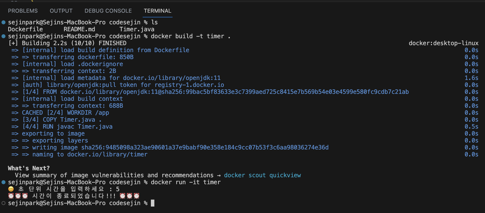
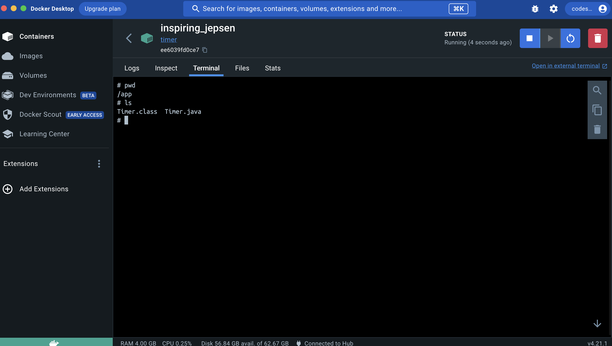
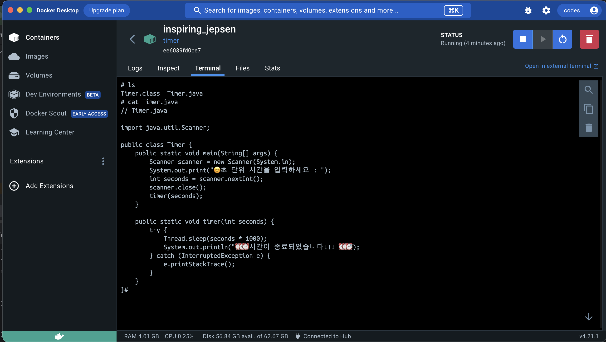
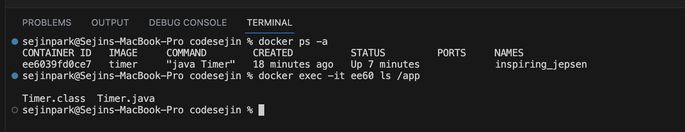

# 도커 이미지로 타이머를 실행해보기



### 1. 호스트 환경에서 현재 디렉토리에 Dockerfile이 있는지 확인하세요 

```ls```

### 2. 도커파일을 이미지로 구워주세요

```docker build -t timer .```

### 3. 이미지를 실행시킬 때, 쉘 환경과 상호 작용하기 위해 -it를 붙여주세요

```docker run -it timer```

### 4. 초 단위 시간을 입력하면 타이머가 작동되고 컨테이너를 종료합니다

&nbsp;

&nbsp;

# 컨테이너 내부 들여다보기


### 1. ```/app``` 디렉토리가 생겼는지 데스크탑에서 확인해봅니다

- 컨테이너를 실행 시킨 뒤 도커 데스크탑으로 이동



    - pwd를 입력해서 현재 작업중인 디렉토리를 확인하면 /app 디렉토리인걸 알 수 있습니다
    - ls를 입력하면 소스 코드와 컴파일된 바이트 코드가 있는걸 확인할 수 있습니다


### 2. 호스트 환경의 소스코드와 컨테이너 내부의 소스코드가 일치하는지 확인해봅시다

- ```cat Timer.java``` 명령어를 통해 코드를 비교해봅시다




### 3. 데스크탑이 아닌 cli로 ```/app``` 디렉토리를 확인해봅시다

- ```docker exec -it [컨테이너_ID] ls /app ``` 명령어를 사용

