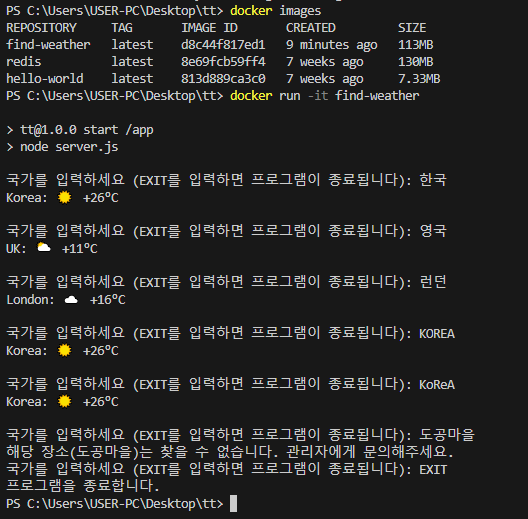

# 나라별 날씨를 확인하자.

프로그램을 시작하여 국가를 입력하여 해당 국가의 날씨를 확인한다.  
날씨 검색 가능한 국가는 프로그램에 등록이 되어야 한다.  

## I. 실행 방법

 - 주의사항: 콘솔 입출력 프로그램으로 애플리케이션을 실행할 때 "-it" 옵션을 추가해주어야 한다.
    - "-it" 옵션은 컨테이너와 상호작용할 수 있게 해준다. 만약, 입출력이 불가능한 상태가 되면 프로그램 및 컨테이너는 종료된다.
```Bash
# 현재 디렉토리의 Dockerfile로 이미지를 빌드한다.
$ docker build -t find-weather .

# 이미지를 확인한다.
$ docker images

# 나라별 날씨 검색 프로그램 이미지를 실행한다.
$ docker run -it find-weather
```

<br/>

## II. 실행 화면

한글 혹은 영문으로 나라를 입력하면 해당 나라의 날씨가 출력된다.  
"HELP"를 입력하면 프로그램 내에 존재하는 나라와 키워드를 확인할 수 있다.  
프로그램을 종료하려면 "Ctrl + C"를 누르거나, "EXIT"를 입력하면 된다.  

<p style="text-align: center;">
    
</p>

<br/>

## III. 코드 분석

 - FROM node:12-alpine: node 프로그램을 실행하기 위해 베이스 이미지를 node로 지정한다.
 - WORKDIR /app: 컨테이너 내부의 작업 디렉토리를 지정한다. "/app" 디렉토리안에 소스 코드가 위치할 것이다.
 - COPY package*.json /app: 프로젝트 설정 파일을 컨테이너 내부로 옮긴다.
 - RUN npm install: 컨테이너 내부에서 "npm install" 명령어를 수행한다. package.json 파일의 명시된 설정을 따른다.
 - COPY . /app: 의존 라이브러리 설치 이후에 소스 코드를 컨테이너 내부로 옮긴다.
 - CMD [ "npm", "start" ]: 컨테이너 실행시 수행될 명령어를 정의한다. 날씨 조회 프로그램이 실행되도록 한다.
```Dockerfile
FROM node:12-alpine

WORKDIR /app
COPY package*.json /app
RUN npm install

COPY . /app
CMD [ "npm", "start" ]
```