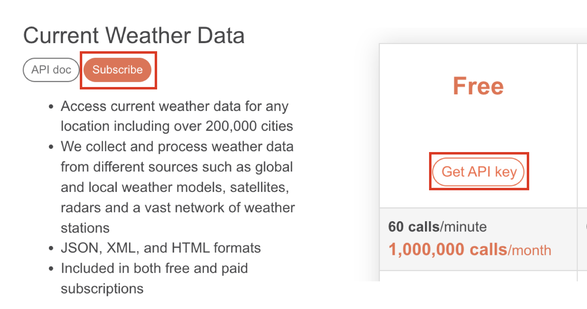
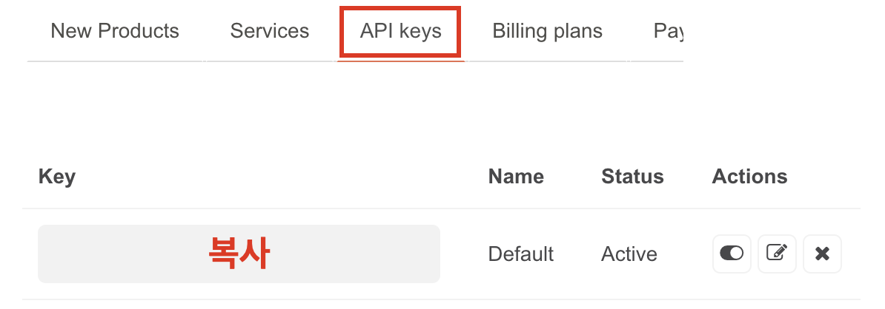

# 날씨 알림 도구 ☀️ 🌧️ ❄️

## 사전 준비
1️⃣ https://openweathermap.org/ 에 접속하여 회원가입 <br><br>
2️⃣ https://openweathermap.org/api 접속
<br><br>
3️⃣ https://home.openweathermap.org/api_keys 접속
<br><br>

## 실행방법
### 1. fork한 폴더로 접근
```
cd /Users/jian/wanted_docker/docker-pro-2308/contest/jian1114
```
### 2. Dockerfile로 이미지 빌드
```
docker build --tag {your-docker-hub-namespace}/weather:latest .
```
### 3. 컨테이너 실행
```
docker run -it {your-docker-hub-namespace}/weather:latest
```
### 4. 복사한 API Key 입력 후 enter
### 5. 본인이 살고 있는 도시 이름을 영어로 입력 후 enter (ex. Suwon, Seoul, Yongin, ...)
