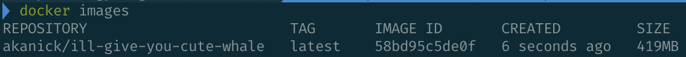
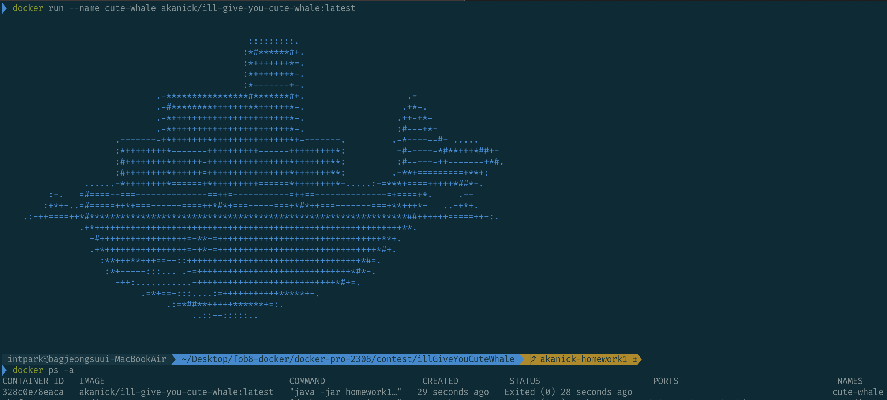

# 대신에 귀여운 고래를 드리겠습니다 🐳
멋진 코드는 없지만 대신에 귀여운 고래를 주는 어플리케이션을 도커 컨테이너로 실행해보자.

## 1.  어플리케이션 작성 & build
Java 프로젝트를 생성해서 어플리케이션을 작성한다. 코드는 Main.java 파일을 참고하자.
프로젝트 빌드도구는 gradle이다. `build.gradle`에 다음을 추가한다.

```gradle
jar {  
  manifest {  
    attributes(  
      // value 부분에는 프로젝트 메인클래스 경로를 적는다.
      'Main-Class': 'org.freeonboarding.docker.Main'  
    )  
  }  
}
```

그리고 `gradle build`를 통해 빌드한다.

## 2. Dockerfile 작성
```
FROM amazoncorretto:17.0.8-al2023-headless

RUN mkdir /app
WORKDIR /app
COPY homework1.jar /app/homework1.jar
RUN chmod +x /app/homework1.jar
ENTRYPOINT ["java", "-jar", "homework1.jar"]
```
1. FROM ... : 기본 이미지 설정. docker hub에서 적절한 JRE를 찾아 넣었다.
2. RUN mkdir /app : 실행 디렉토리 생성.
3. WORKDIR /app : 실행 디렉토리 지정. 이후의 명령은 이 디렉토리 기준으로 실행된다.
4. COPY : 호스트머신의 실행할 .jar 파일을 컨테이너 안으로 복사.
5. RUN ... : 실행권한 부여.
6. ENTRYPOINT : 엔트리포인트 명령은 실행할때의 기본 명령어를 지정할 수 있다. java로 homework1.jar라는 jar 파일을 실행하게끔 지정했다.

## docker build
작성한 Dockerfile를 가지고 컨테이너 이미지를 빌드.
```
$ docker build --tag akanick/ill-give-you-cute-whale:latest .  
```
`docker images`로 생성된 이미지 확인.


## docker run
다음의 명령어 실행 시 결과 확인 가능.
```
$ docker run --name cute-whale akanick/ill-give-you-cute-whale
```

- --name : 실행된 컨테이너의 별명
