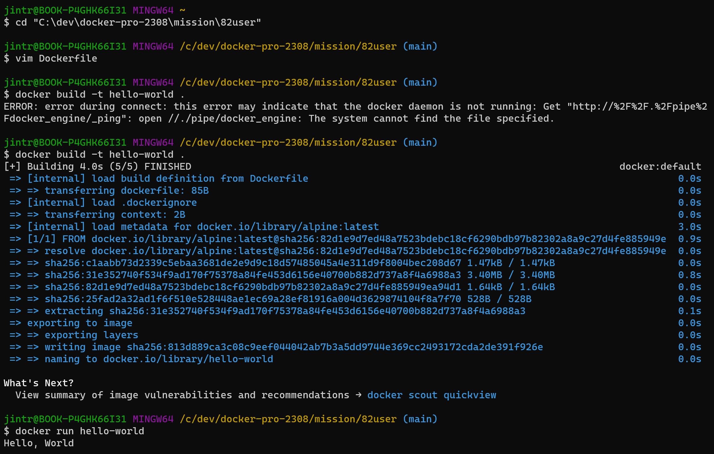

## 1. 컨테이너 기술이란 무엇입니까?
> 실행중인 컴퓨터의 호스트 운영체제에 격리된 공간을 설정하고, 이 격리공간 내에 호스트 운영체제로부터 독립된 프로세스를 실행시키는 기술과 이를 위한 소프트웨어 구성 일체를 이야기합니다. 동일한 하드웨어 아키텍처(특히 CPU)와 동일한 OS 커널을 보유한 수많은 컴퓨터에서 컨테이너로 이미지화한 소프트웨어의 동일한 동작을 보장합니다.

## 2. 도커란 무엇입니까?
> 리눅스의 응용 프로그램들을 프로세스 격리 기술들을 사용해 컨테이너로 실행하고 관리하는 오픈 소스 프로젝트입니다.

## 3. 도커 파일, 도커 이미지, 도커 컨테이너의 개념은 무엇이고, 서로 어떤 관계입니까?
- 도커 파일
    > docker에서 이미지를 생성하기 위한 용도로 작성하는 파일입니다.
- 도커 이미지
    > 컨테이너를 생성하기 위한 템플릿입니다.
- 도커 컨테이너
    > 컨테이너 이미지의 실행 가능한 인스턴스입니다.

## 4. [실전 미션] 도커 설치하기

