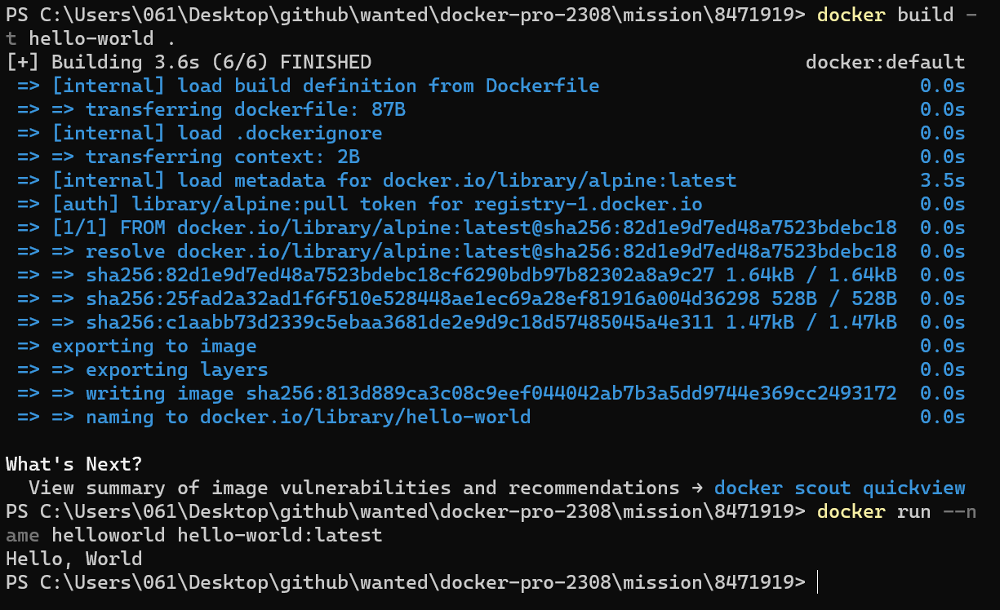

검색 하지 않고 쌩 뇌에서 나온 답변입니다... 양해 바랍니다.

## 1. Container 기술이란 무엇입니까? (100자 이내로 요약)

---

- 가상의 OS환경을 물류를 나르는데 쓰이는 컨테이너처럼 독립된 환경에 가두고 그 안에서 마치 하나의 독립된 컴퓨터처럼 실행할 수 있도록 구축한 환경을 컨테이너라고 부르고, 그러한 컨테이너를 만드는 작업을 Containerize라고 한다.

## 2. 도커란 무엇입니까? (100자 이내로 요약)

---

- Containerize를 도와주는 도구로, 프로그램을 변하지 않는 이미지로 만들고 이러한 이미지들을 이용해서 Layer를 쌓아 컨테이너의 환경을 구축하게끔 할 수 있다.

## 3. 도커 파일, 도커 이미지, 도커 컨테이너의 개념은 무엇이고, 서로 어떤 관계입니까?

---

- 도커 파일은 도커 이미지 빌드시에 사용하는 설정파일이며, Base 이미지를 기반으로 새로운 이미지를 빌드할 수 있다. 여기서 이미지를 빌드한다는 것은 도커 파일을 기반으로 새로운 이미지를 생성한다는 뜻이다.
- 도커 이미지는 하나의 프로그램이라고 생각하면 된다. 하나의 이미지를 베이스로 위에 Layer를 쌓아서 새로운 이미지를 만들 수 있다. 그리고 이런 이미지를 컨테이너화 해서 해당 프로그램을 실행시킬 수 있다.
- 도커 컨테이너는 도커 이미지를 이용해서 만든 하나의 독립적인 컴퓨터라고 생각하면 된다. 컨테이너는 HOST OS(자신의 PC의 OS)를 이용하므로 가상 머신에 비해 훨씬 가벼운게 특징이다.

## 4. [실전 미션] 도커 설치하기 (참조: 도커 공식 설치 페이지)

---

