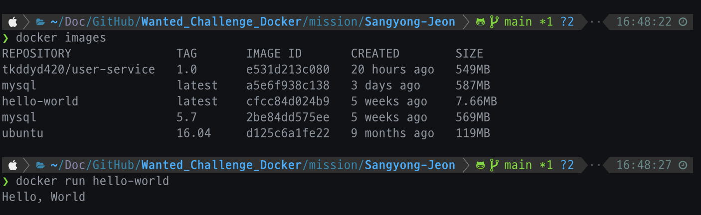

# 1. 컨테이너 기술이란 무엇입니까?

컨테이너 기술은 애플리케이션을 실행하는 데 사용되는 가상화 기술입니다.

애플리케이션과 종속성을 격리된 환경에 패키징하여 이식성과 확장성을 높이고, 개발과 배포를 용이하게 합니다.

대표적으로 Docker와 Kubernates가 있습니다

# 2. 도커란 무엇입니까?

도커는 컨테이너 기반의 오픈소스 플랫폼입니다.

애플리케이션과 종속성을 격리된 환경인 컨테이너로 패키징하여 효율적이고 일관된 배포를 가능하게 해주는 기술입니다.

개발자와 시스템 관리자가 애플리케이션을 쉽게 빌드, 배포, 실행하고 관리할 수 있게 해줍니다.

# 3. 도커 파일, 도커 이미지, 도커 컨테이너의 개념은 무엇이고, 서로 어떤 관계입니까?

- 도커 파일
  - 도커 이미지를 생성하기 위한 설정 파일
  - 애플리케이션을 실행하는데 필요한 환경과 종속성을 정의
- 도커 이미지
  - 도커 파일을 기반으로 만들어진 가상화된 애플리케이션과 그 종속성을 포함하는 패키지
  - 실행할 애플리케이션과 런타임, 라이브러리 등이 모두 포함되어 있음
- 도커 컨테이너
  - 도커 이미지를 기반으로 실행된 가상 환경으로, 격리되고 독립적으로 실행되는 애플리케이션 인스턴스
  - 호스트(Host)와는 독립적으로 동작하며, 이미지를 토대로 생성되었기에 이식성과 확장성이 뛰어남
- 관계
  - 도커 파일은 도커 이미지를 생성하는데 사용
  - 도커 이미지는 도커 컨테이너를 생성하고 실행하는데 사용
  - 도커 파일로부터 도커 이미지를 빌드하고, 이미지를 실행하여 도커 컨테이너를 생성하여 애플리케이션을 독립적으로 실행하게 됨

# 4. [실전 미션] 도커 설치하기

