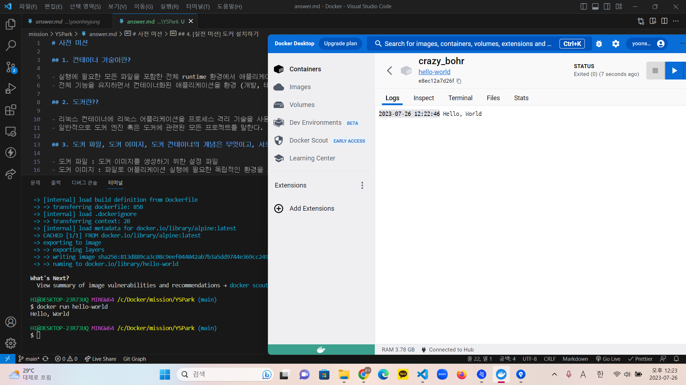

# 사전 미션

## 1. 컨테이너 기술이란?

- 실행에 필요한 모든 파일을 포함한 전체 runtime 환경에서 애플리케이션을 패키징하고 격리할 수 있는 기술
- 전체 기능을 유지하면서 컨테이너화된 애플리케이션을 환경 (개발, 테스트, 생산 등) 간에 쉽게 이동할 수 있다.

## 2. 도커란??

- 리눅스 컨테이너에 리눅스 어플리케이션을 프로세스 격리 기술을 사용하여 더 쉽게 컨테이너로 실행하고 관리할 수 있게 해주는 오픈소스 프로젝트
- 일반적으로 도커 엔진 혹은 도커에 관련된 모든 프로젝트를 말한다.

## 3. 도커 파일, 도커 이미지, 도커 컨테이너의 개념은 무엇이고, 서로 어떤 관계인가?

- 도커 파일 : 도커 이미지를 생성하기 위한 설정 파일
- 도커 이미지 : 파일로 어플리케이션 실행에 필요한 독립적인 환경을 포함, 소스 코드, 라이브러리, 종속성, 도구 및 응용 프로그램을 실행하는데 필요한 기타 파일을 포함하는 불변 파일
- 도커 컨테이너 : 응용프로그램을 빠르고 쉽게 시작할 수 있는 portable units 이다.

## 4. [실전 미션] 도커 설치하기

