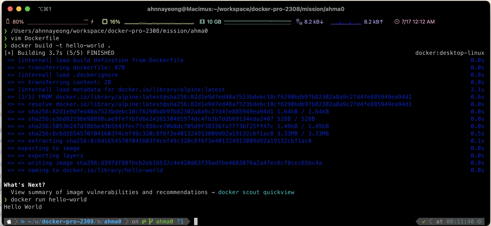

## 1. 컨테이너 기술이란 무엇입니까? (100자 이내로 요약)

운영체제에서 실행되는 프로세스를 격리(Isolation)하여 별도의 실행 환경을 제공해주며, 해당 프로세스는 운영체제 상에서 실행되는 유일한 프로세스인 것처럼 작동하는 기술

## 2. 도커란 무엇입니까? (100자 이내로 요약)

컨테이너 기술을 사용하여 다양한 환경에서 애플리케이션 실행 환경을 구축 및 운용하기 위한 오픈소스 플랫폼

## 3. 도커 파일, 도커 이미지, 도커 컨테이너의 개념은 무엇이고, 서로 어떤 관계입니까?

### Dockerfile

- 도커 이미지를 빌드하는 방법을 정의하는 스크립트 
- Docker에서는 환경 정보를 저장하는 파일을 Dockerfile이라고 함.
- 이 Dockerfile에는 컨테이너의 구동에 필요한 정보가 작성되어 있음.

### Docker image

- 파일로 어플리케이션 실행에 필요한 독립적인 환경을 포함하며, 런타임 환경을 위한 일종의 템플릿
- 특정 환경에 대한 정보가 변하지 않고 저장되는 정적인 형태의 파일
- 소스 코드, 라이브러리, 종속성, 도구 및 응용 프로그램을 실행하는데 필요한 기타 파일을 포함하는 불변(변경 불가) 파일
- 이미지는 읽기 전용이므로 스냅샷이라고도 하며, 특정 시점의 애플리케이션과 가상 환경을 나타냄.

### Docker container

- 이미지(Image)를 실행한 상태
- 응용프로그램의 종속성과 함께 응용프로그램 자체를 패키징 or 캡슐화하여 격리된 공간에서 프로세스를 동작시키는 기술
- 도커 컨테이너 사용자가 기본 시스템에서 애플리케이션을 분리할 수 있는 가상화된 런타임 환경 
- 컨테이너는 자율적(autonomous)이기 때문에 strong isolation을 제공하며 서로 방해하지 않음.

### 관계

- Docker file을 빌드해서 이미지를 생성한다. 
- 컨테이너가 존재하려면 이미지를 실행해야 하는 반면, 이미지는 컨테이너 없이 존재 가능.
    - 따라서 컨테이너는 이미지에 종속되어 런타임 환경을 구성하고 애플리케이션을 실행하는 데 사용됨.
- 이미지를 동적인 형태로 변경한 것이 컨테이너.
- 컨테이너가 구동된다는 것은 우리가 필요로 하는 OS와 특정 환경이 경량 가상화로 구현된다는 것
- 도커 이미지는 도커 컨테이너에서 코드를 실행한다. 실행중인 컨테이너를 만들려면 도커 이미지에 핵심 기능의 쓰기 가능 계층을 추가한다.
- 도커 컨테이너는 실행중인 이미지 인스턴스로 간주한다.
- 각각의 고유한 데이터 상태를 가진 동일한 이미지에서 여러개의 컨테이너를 만들 수 있다.
- 한 서버는 여러 개의 컨테이너를 가져도 당연히 상관없으며, 컨테이너는 각각 독립적으로 실행

## 4. [실전 미션] 도커 설치하기 (참조: 도커 공식 설치 페이지)

