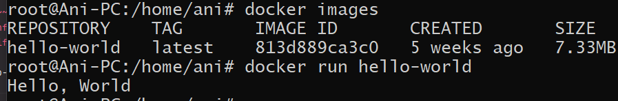

## 사전미션

 

## Q. 컨테이너 기술은 무엇일까?
#### A. 컨테이너란 서비스를 구동하는 환경을 격리한 공간을 말한다. 소프트웨어가 현재의 컴퓨터 A에서 다른 컴퓨터 B로 이동하더라도 안정적으로 실행되도록 하기 위해 나온 개념이다.

#### 컨테이너 기술은 가볍고, 컴퓨터 자원의 낭비가 많지 않으며 구동 방식이 간단하다. 그러나 호스트 OS 커널을 공유하는 구조이기에 안정성에 있어서는 우려되는 부분이 존재한다.

## Q. 도커란 무엇일까?
#### A. 오픈소스를 기반으로한 컨테이너 관리 플랫폼이 바로 도커이다. 

#### 리눅스 컨테이너(LXC) 기술을 기반하며 이보다 이식성을 향상시키고 데이터와 코드의 분산된 관리를 지원하며 이동성과 유연성을 높였다.

## Q. 도커 이미지, 도커 파일과  도커 컨테이너의 개념은 각각 무엇이고 서로 어떤 관계인가?
#### A. 도커 이미지란 서비스 운영에 필요한 서버 프로그램, 소스코드 및 라이브러리, 컴파일된 실행 파일을 묶는 형태를 말한다. 도커 파일은 이 이미지를 생성하기 위한 용도로 작성하는 파일이며, 도커 컨테이너는 이미지를 실행한 상태로 프로그램의 종속성과 함께 프로그램 자체를 패키징하거나 캡슐화하고 격리된 공간에서 프로세스를 동작시키는 기술이다.

#### 컨테이너가 존재하려면 이미지를 실행해야 하는 반면, 이미지는 컨테이너 없이 존재할 수 있다.

### Q. 도커 설치 및 도커 컨테이너를 실행한 화면!
#### A.

 

###### 참고 :: [클라우드 가상화 기술 정리 2](https://m.blog.naver.com/shakey7/221600166205), [컨테이너 기술](https://velog.io/@xgro/%EC%BB%A8%ED%85%8C%EC%9D%B4%EB%84%88-%EA%B8%B0%EC%88%A0),[Docker Container와 Image란 무엇인가?](https://sunrise-min.tistory.com/entry/Docker-Container%EC%99%80-Image%EB%9E%80-%EB%AC%B4%EC%97%87%EC%9D%B8%EA%B0%80),[도커파일(Dockerfile) 의 개념, 작성 방법/문법, 작성 예시](https://toramko.tistory.com/entry/docker-%EB%8F%84%EC%BB%A4%ED%8C%8C%EC%9D%BCDockerfile-%EC%9D%98-%EA%B0%9C%EB%85%90-%EC%9E%91%EC%84%B1-%EB%B0%A9%EB%B2%95%EB%AC%B8%EB%B2%95-%EC%9E%91%EC%84%B1-%EC%98%88%EC%8B%9C)