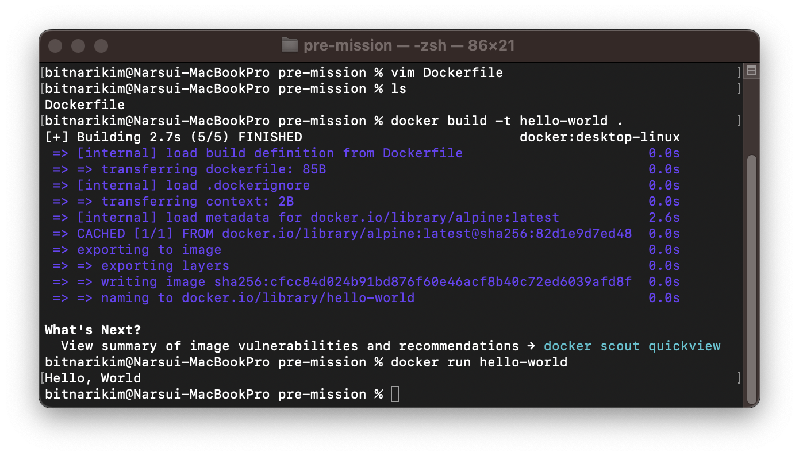

## 1. 컨테이너 기술이란 무엇입니까? (100자 이내로 요약) 
- 격리된 공간에서 프로세스가 동작하는 기술로, 애플리케이션을 실행하기 위해 필요한 라이브러리나 애플리케이션 등을 하나로 모아 마치 각각의 독립적인 프로그램처럼 관리되고 실행되는 기술입니다.

 

## 2. 도커란 무엇입니까? (100자 이내로 요약) 
- 도커는 컨테이너 기반의 오픈소스 가상화 플랫폼으로, 더 쉽게 컨테이너를 실행하고 관리할 수 있게 해주는 오픈소스 프로젝트입니다.

 

## 3. 도커 파일, 도커 이미지, 도커 컨테이너의 개념은 무엇이고, 서로 어떤 관계입니까?
### 도커 파일
- 이미지 생성의 출발점으로, 이미지를 구성하기 위한 명령어들을 작성하여 이미지를 구성할 수 있습니다. 즉, 만들 이미지에 대한 정보를 기술한 템플릿입니다.
- 도커 파일을 빌드하면 자동으로 이미지가 생성됩니다. => 도커 파일을 통해 애플리케이션 빌드 및 배포를 자동화할 수 있습니다.
### 도커 이미지
- 컨테이너를 실행할 수 있는 실행파일, 설정 값들을 가지고 있는 것, 즉 컨테이너를 생성할 때 필요한 요소입니다.
- 읽기 전용 레이어로 구성되어 여러 레이어로된 바이너리 파일로 존재합니다.
### 도커 컨테이너
- 도커 이미지로 생성되며, 컨테이너를 생성하면 해당 이미지의 목적에 맞는 파일이 들어있는 독립된 공간(프로세스)이 생성됩니다.
- 독립된 공간이기 때문에 호스트와 다른 컨테이너들로부터 격리된 시스템 자원 및 네트워크를 사용할 수 있습니다.
- 호스트와 다른 컨테이너들로부터 분리되어 있으므로 특정 컨테이너에서 어떤 이벤트가 일어나도 다른 컨테이너와 호스트는 변화가 없습니다. (같은 도커 이미지로 A, B 두개의 컨테이너를 생성한 뒤에 A 컨테이너를 수정해도 B 컨테이너에는 영향을 주지 않습니다.)
### 관계
- 도커 파일을 가지고, 도커 이미지를 생성하고, 생성된 이미지를 가지고, 도커 컨테이너를 생성합니다.
- 도커 이미지는 설계서, 컨테이너는 설계서로 만들어진 상품으로 예시를 들 수 있습니다.

 

## 4. [실전 미션] 도커 설치하기

