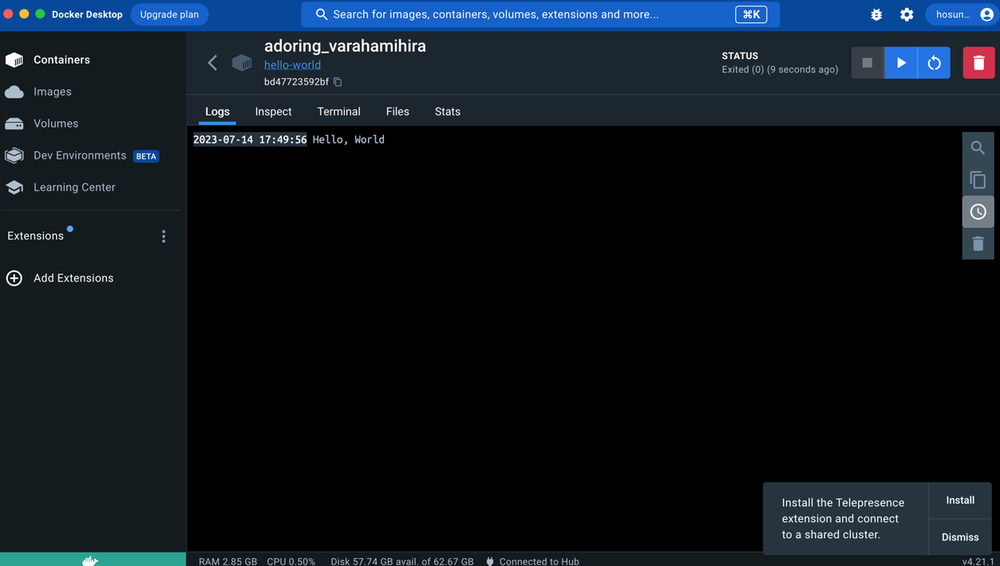

# 사전 미션

## 1. 컨테이너 기술이란 무엇입니까
* 컨테이너는 애플리케이션과 필요한 모든 파일을 하나의 런타임 환경으로 묶는 데 사용하는 기술이다. 단일 컨테이너로서 컨테이너는 모든 컨텍스트의 운영체제에서 쉽게 이동 및 실행할 수 있다.
* 컨테이너를 사용하면 소프트웨어를 격리하고 다른 운영체제, 하드웨어, 네트워크, 스토리지 시스템 및 보안 정책에서 독립적으로 작업할 수 있다.
* 컨테이너 기반 애플리케이션을 개발, 테스트 및 생산 환경 전반에서 원활하게 전환할 수 있다. 운영체제가 컨테이너에 포함되어 있지 않기 때문에 각 컨테이너는 최소한의 컴퓨팅 리소스를 사용하여 단순하고 간편하다.
* 컨테이너를 사용하면 사용자는 호환되지 않는 환경으로 인해 발생하는 충돌을 방지하고 시스템 전반에서 일관된 성능을 얻을 수 있다. 개발자는 디버깅 또는 다양한 서버 환경에 대한 다시 쓰기가 아닌 애플리케이션 자체에 집중할 수 있다.
* 운영 체제가 없어 개발자가 클러스터에 컨테이너를 효율적으로 구축할 수 있으며 개별 컨테이너에 복잡한 애플리케이션의 단일 구성요소가 포함된다.
***
## 2. 도커란 무엇입니까
* 도커는 컨테이너 기반의 오픈소스 가상화 플랫폼이다. 프로세스 격리 기술들을 사용해 컨테이너로 실행하고 관리하는 오픈소스 프로젝트이다.
* 위에서 알아본 컨테이너로 다양한 프로그램, 실행환경을 추상화하고 동일한 인터페이스를 제공하여 프로그램의 배포 및 관리를 단순하게 해준다.
* 도커에서 도커 허브로 이미지(컨테이너의 틀)를 하나 만들면 이 이미지를 이용해 계속 컨테이너를 복사할 수 있다.
***
## 3. 도커 파일, 도커 이미지, 도커 컨테이너의 개념은 무엇이고 서로 어떤 관계 입니까?
### 도커 파일
* 도커파일은 docker에서 이미지를 생성하기 위한 용도로 작성하는 파일이다. 만든 이미지에 대한 정보를 기술해둔 템플릿 이라고 보면된다.
* 빌드 명령어가 포함되어 잇다. 이 빌드 명령어는 환경변수를 사용하거나 소스코드를 이미지에 복사하는 등의 작업을 수행한다.
* 명령어는 중간 이미지를 만든다

### 도커 이미지
* 도커 이미지는 파일로 애플리케이션 실행에 필요한 독립적인 환경을 포함하며, 런타임 환경을 위한 일종의 템플릿 이다. 
* 도커 이미지는 소스코드, 라이브러리, 종속성, 도구 및 응용 프로그램을 실행하는데 필요한 기타 파일을 포함하는 불변의 파일이다.
* 이미지는 읽기 전용이므로 스냅샷이라고도 하며, 특정 시점의 애플리케이션과 가상환경을 나타낸다.

### 도커 컨테이너
* 사용자가 기본 시스템에서 애플리케이션을 분리할 수 있는 가상화된 런타임 환경이다.
* 중요 기능은 컨테이너 내부에서 실행되는 컴퓨팅 환경의 표준화이다. 응용 프로그램이 동일한 환경에서 작동하도록 할 뿐 아니라 다른 사람과의 공유도 단순화한다.
* 컨테이너는 자율적이기 때문에 strong isolation을 제공하며 서로 방해하지 않는다 [격리되어 있다.]

### 관계
* 도커 이미지를 생성하기 위해 도커 파일을 사용한다.
* 컨테이너가 존재하려면 이미지를 실행해야 하는 반면, 이미지는 컨테이너 없이 존재할 수 있다.
* 컨테이너는 이미지에 종속되어 런타임 환경을 구성하고 애플리케이션을 실행하는데 사용된다.
* 도커 이미지는 도커 컨테이너에서 코드를 실행한다. 실행중인 컨테이너를 만들려면 도커 이미지에 핵심 기능의 쓰기 가능 계층을 추가한다.
* 도커 컨테이너는 실행중인 이미지 인스턴스로 간주한다. 각각의 고유한 데이터 상태를 가진 동일한 이미지에서 여러개의 컨테이너를 만들 수 있다.

DokerFile --(Build)--> Image --(Create)--> Container

## 4. [실전 미션] 도커 설치하기 
