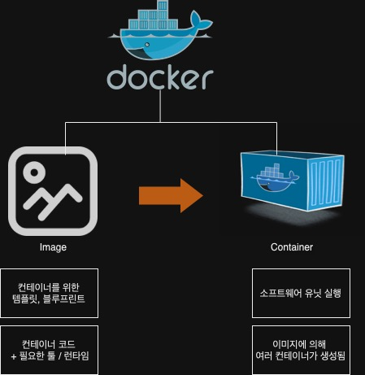
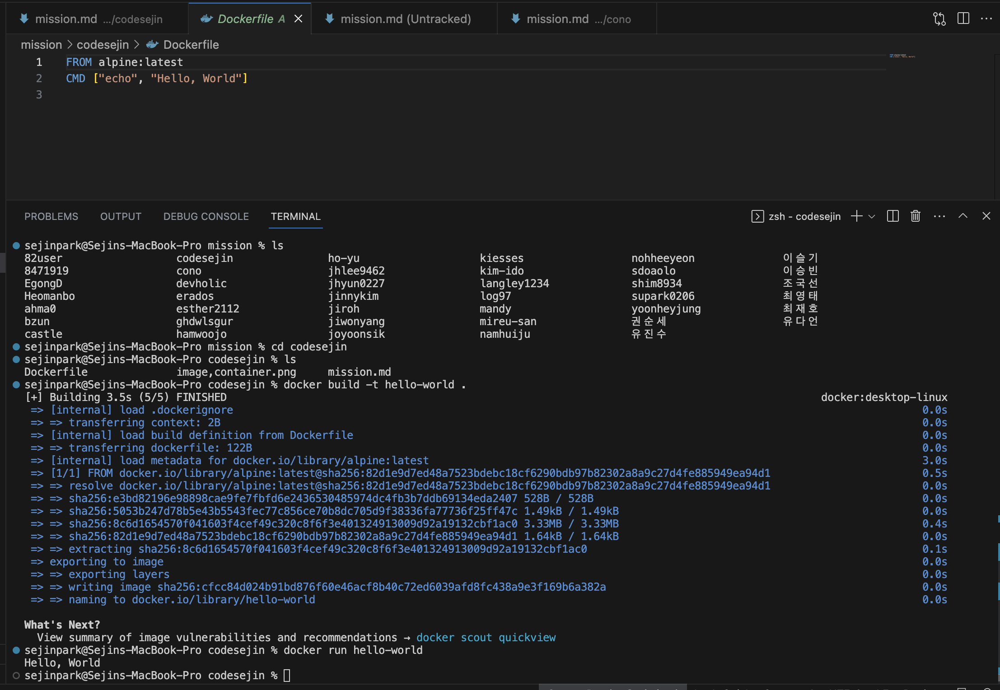
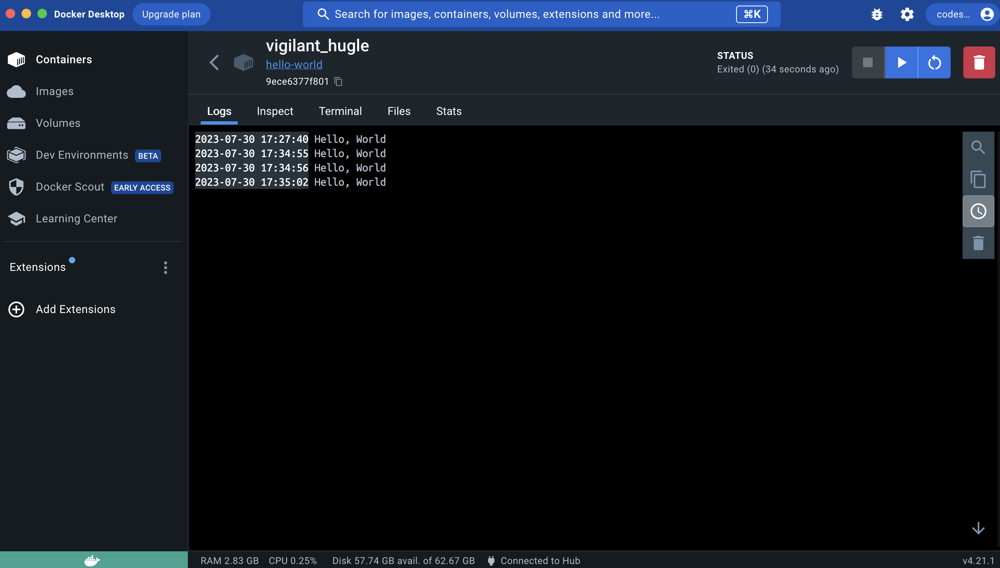

# [프리온보딩] 사전미션

## 1. 컨테이너 기술이란 무엇입니까? (100자 이내로 요약)
> 도커란 컨테이너를 생성하고 관리하기 위한 도구이다. 소프트웨어 개발에서 컨테이너는 표준화된 소프트웨어 유닛이다.
> 이는 기본적으로 코드 패키지이며, 해당 코드를 실행하는데 필요한 종속성과 도구가 포함되어있는 것이다.
> 프로그래밍 언어와 런타임 및 종속성, 해당 코드를 실행할때 필요한 기타 도구들이 포함되어있는 패키지이다.
> 컨테이너에 있는 패키지로 동일한 환경에서 동일한 애플리케이션을 실행할 수 있다

##2. 도커란 무엇입니까? (100자 이내로 요약)

> 도커는 컨테이너의 생성 및 관리 프로세스를 단순화하는 도구이다.
> 특정 프로젝트 A와 B가 있을 경우, 각각 프로그래밍언어의 버전이 다를 경우 충돌이 생길 수 있다.
> 또한 프로젝트로 옮겨갈때마다 기존 버전을 지우고 다른 버전을 새로 설치해야 하는 번거로움이 있다.
> 각 버전을 컨테이너에 보유하고 각각 프로젝트에는 그들만의 컨테이너가 존재하도록 하면 전환해도 그대로 작동된다
> 호스트 컴퓨터가 아닌 컨테이너에 모든 것이 들어있기 때문에 쉽게 프로젝트를 전환할 수 있다.

##3. 도커 파일, 도커 이미지, 도커 컨테이너의 개념은 무엇이고, 서로 어떤 관계입니까?

> 컨테이너는 애플리케이션, 웹사이트, Node서버, 애플리케이션을 실행하는 전체 환경 등 무엇이든 포함하는 작은 패키지이다.
> 즉, 컨테이너에 소프트웨어 실행 유닛이 존재한다

> 이미지는 dissolver라는 개념으로, 템플릿, 컨테이너의 블루프린트가 된다
> 실제로 코드와 코드를 실행하는데 필요한 도구를 포함한다. 또한 이미지를 사용하여 여러 컨테이너를 만들 수 있다.

> 그런 다음메 컨테이너가 실행되어 코드를 실행한다. 이미지를 한번 정의하면 다른 시스템, 다른 서버에서 여러번 실행할 수 있다.
> 이미지는 모든 설정 명령과 모든 코드가 포함된 공유 가능한 패키지이고, 컨테이너는 그러한 이미지의 구체적인 실행 인스턴스이다.
> 즉, 이미지를 기반으로 컨테이너를 실행하는데 도커의 핵심 기본 개념이다.

> 이미지를 생성할때 방법은 2가지이다. 1. 존재하는 이미지 사용(Docker Hub), 2. 커스텀한 이미지(도커파일에 작성)

> 도커파일은 이미지를 생성하기 위한 용도로 작성하는 파일로, 텍스트 문서이며, 여러가지 지시어를 사용하여 이미지를 제작할 수 있다.

##4. [실전 미션] 도커 설치하기 (참조: 도커 공식 설치 페이지)

아래 도커 설치부터 실행 튜토리얼을 참조하여 도커를 설치하고, 도커 컨테이너를 실행한 화면을 캡쳐해서 Pull Request에 올리세요.

