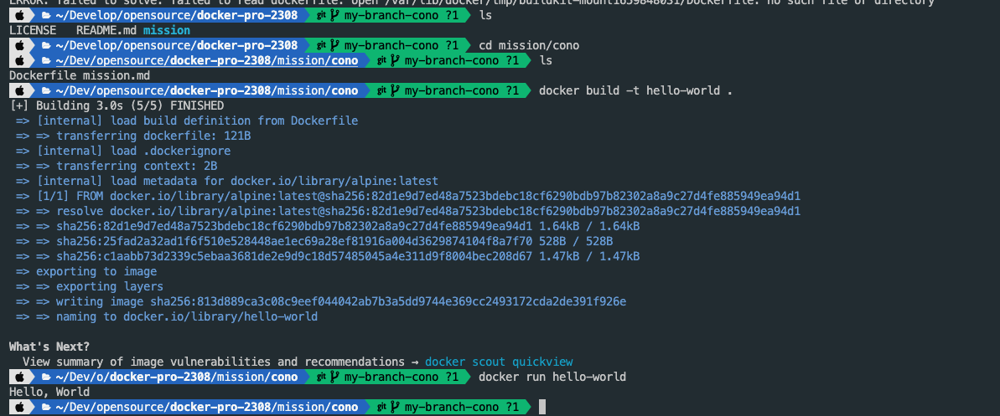

## 사전 미션

1. 컨테이너 기술이란 무엇입니까? (100자 이내로 요약)
   > 컨테이너는 소프트웨어 서비스를 실행하는 데 필요한 특정 버전의 프로그래밍 언어 런타임 및 라이브러리와 같은 종속 항목과 애플리케이션 코드를 함께 포함하는 경량 패키지입니다.
2. 도커란 무엇입니까? (100자 이내로 요약)
   > Docker는 애플리케이션을 빠르게 빌드, 테스트 및 배포할 수 있는 소프트웨어 플랫폼입니다. Docker 는 라이브러리, 시스템 도구, 코드 및 런타임을 포함하여 소프트웨어를 실행하는 데 필요한 모든 것을 포함하는 컨테이너 라는 표준화된 단위로 소프트웨어를 패키징합니다
3. 도커 파일, 도커 이미지, 도커 컨테이너의 개념은 무엇이고, 서로 어떤 관계입니까?

   - docker file
     > Dockerfile은 Docker 이미지를 빌드하는 데 사용되는 일련의 지침 또는 명령이 포함된 텍스트 파일입니다.
   - docker image
     > Docker 이미지는 코드, 런타임, 시스템 도구, 라이브러리 및 종속성을 포함하여 소프트웨어를 실행하는 데 필요한 모든 것을 포함하는 가볍고 실행 가능한 독립 실행형 소프트웨어 패키지입니다
   - docker container
     > Docker 컨테이너는 Docker 이미지의 실행 중인 인스턴스입니다. 애플리케이션과 해당 종속성을 캡슐화하는 가볍고 격리된 환경으로 생각할 수 있습니다.

4. [실전 미션] 도커 설치하기

   
