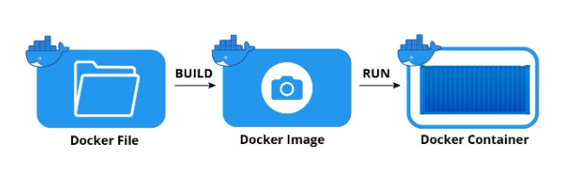

# 사전과제
목차
1. [컨테이너-기술이란-무엇입니까](#컨테이너-기술이란-무엇입니까--100자-이내로-요약-)
2. [도커란 무엇입니까?](#도커란-무엇입니까--100자-이내로-요약-)
3. [도커 파일, 도커 이미지, 도커 컨테이너의 개념은 무엇이고, 서로 어떤 관계입니까?](#도커-파일-도커-이미지-도커-컨테이너의-개념은-무엇이고-서로-어떤-관계입니까)
4. [도커 빌드 실행 결과 이미지](#도커-결과-이미지)

## 컨테이너 기술이란 무엇입니까? (100자 이내로 요약)

논리적인 공간(컨테이너)을 만들어 다양한 어플리케이션을 설치해 하나의 서버처럼 사용할 수 있는 패키지입니다.
각 서버에서 컨테이너를 구동해 그 안에 존재하는 어플리케이션을 별도의 설정 없이 쉽게 사용할 수 있습니다.
----------
## 도커란 무엇입니까? (100자 이내로 요약)

도커(Docker)는 리눅스 컨테이너에 리눅스 어플리케이션을 프로세스 격리기술을 사용하여 더 쉽게 컨테이너로 실행하고 관리할 수 있게 해주는 오픈소스 프로젝트 입니다. 도커는 일반적으로 도커 엔진(Docker Engine) 혹은 도커에 관련된 모든 프로젝트를 말합니다.

-------
## 도커 파일, 도커 이미지, 도커 컨테이너의 개념은 무엇이고, 서로 어떤 관계입니까?

### 도커파일란?
- 도커 파일(Docker file)는 Docker Image를 생성하기 위한 설정 파일입니다. 파일 내 작성된 구문으로 Docker Image가 만들어집니다.
- 만들 이미지에 대한 정보를 기술해 둔 **템플릿(template)**

### 도커이미지란?
- 도커 이미지(Docker Image)는 컨테이너를 생성할 때 필요한 요소이며, 가상 머신을 생성할 때 사용하는 iso 파일과 비슷한 개념입니다.
- 이미지는 컨테이너를 생성하고 실행할 때 읽기 전용으로 사용되며 여러 계층으로 된 바이너리 파일로 존재합니다.

### 도커 컨테이너?
- 도커 컨테이너(Docker Container)는 도커 이미지로 생성할 수 있으며, 컨테이너를 생성하면 해당 이미지의 목적에 맞는 파일이 들어 있는, 호스트와 다른 컨테이너로부터 격리된 시스템 자원 및 네트워크를 사용할 수 있는 독립된 공간(프로세스)이 생성됩니다.

### 그러면 서로 어떠한 관계인가?

- Docker File -> Docker Image: Docker File은 도커 이미지를 만들때 사용하는 파일. docker build 명령어를 실행시키면 도커 이미지를 만들 수 있습니다.

- Docker Image -> Docker Container: Docker Image를 docker run 명령어를 실행시키면 Docker Container를 만들 수 있습니다.

## 도커 결과 이미지
