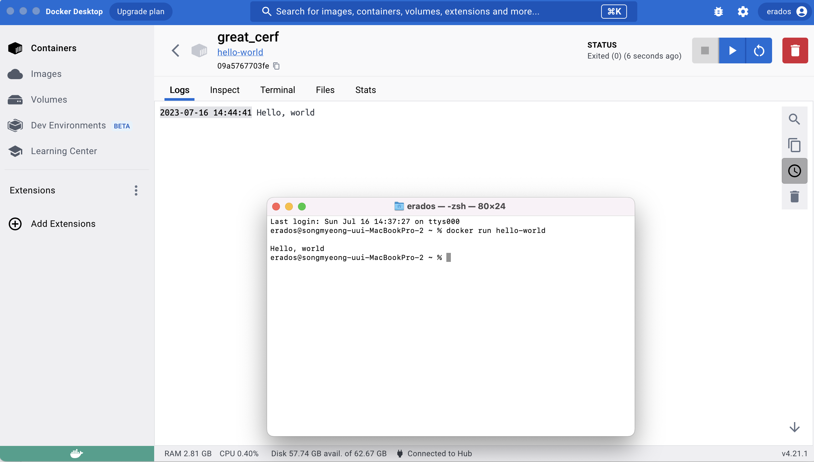

# 사전 미션

## 1. 컨테이너 기술이란 무엇입니까? (100자 이내로 요약)

- 호스트 PC 의 OS 와 커널을 사용하여 서로 격리된 어플리케이션 동작 환경을 만드는 기술

## 2. 도커란 무엇입니까? (100자 이내로 요약)

- 컨테이너 관리 플랫폼

## 3. 도커 파일, 도커 이미지, 도커 컨테이너의 개념은 무엇이고, 서로 어떤 관계입니까?

- **도커 파일**은 컨테이너가 가질 여러 환경들에 대한 정의가 들어있는 파일입니다.
- **도커 이미지**는 도커 파일을 통해 환경을 구축하고 이 환경을 freeze 한 파일입니다.
- **도커 컨테이너**는 도커 이미지가 하나의 인스턴스로 실행된 것을 말합니다.
- 즉, 도커 파일에서 도커 이미지가 생성되고 도커 이미지로 도커 컨테이너를 생성합니다.

## 4. [실전 미션] 도커 설치하기 (참조: 도커 공식 설치 페이지)

