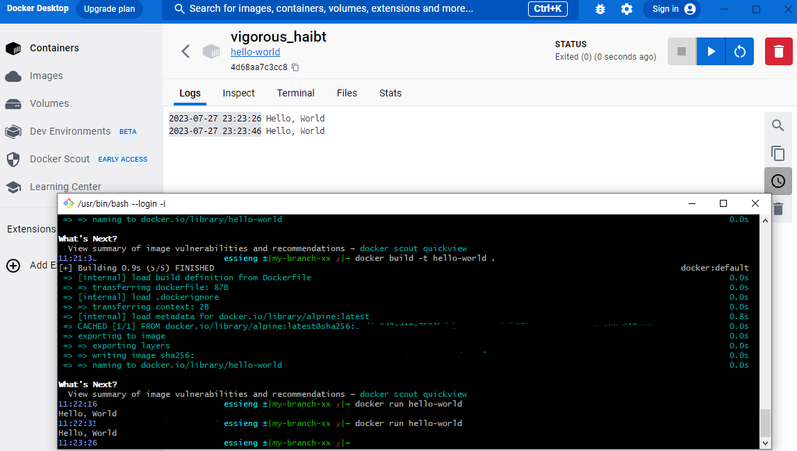

1. 컨테이너 기술이란 무엇입니까? (100자 이내로 요약)
    - 컨테이너 기술이란 애플리케이션과 필요한 라이브러리, 설정 등을 격리된 환경에 패키징하여 이식성과 확장성을 높이고, 빠른 배포와 관리를 가능하게 하는 기술입니다.
2. 도커란 무엇입니까? (100자 이내로 요약)
    - Docker는 컨테이너 기반의 가상화 기술로, 애플리케이션과 환경을 독립적으로 격리시켜 이식성과 확장성을 향상시키며, 빠른 배포와 운영을 지원하는 플랫폼입니다.
3. 도커 파일, 도커 이미지, 도커 컨테이너의 개념은 무엇이고, 서로 어떤 관계입니까?
    - 도커 파일 : 도커 이미지를 생성하는데 사용되는 텍스트 파일로, 애플리케이션과 관련된 설정, 종속성, 명령어 등을 기술합니다.
    - 도커 이미지 : 도커 파일을 기반으로 만들어진 실행 가능한 패키지로, 애플리케이션과 실행에 필요한 모든 것들을 포함하고 있습니다.
    - 도커 컨테이너 : 도커 이미지의 인스턴스로, 격리된 환경에서 애플리케이션과 그 종속성을 실행하는 런타임 환경입니다.
    - 셋의 관계 : 도커 파일은 도커 이미지를 만들기 위한 설계도이며, 도커 이미지는 컨테이너를 생성하는데 사용됩니다. 여러 개의 컨테이너를 생성할 수 있고, 각 컨테이너는 동일한 이미지를 기반으로 작동합니다. 이렇게 도커 파일을 통해 이미지를 만들고, 이미지를 기반으로 여러 컨테이너를 생성하여 애플리케이션을 실행하고 관리할 수 있습니다.
4. [실전 미션] 도커 설치하기 (참조: [도커 공식 설치 페이지](https://docs.docker.com/engine/install/))
- 아래 `도커 설치부터 실행 튜토리얼`을 참조하여 도커를 설치하고, 도커 컨테이너를 실행한 화면을 캡쳐해서 Pull Request에 올리세요.
