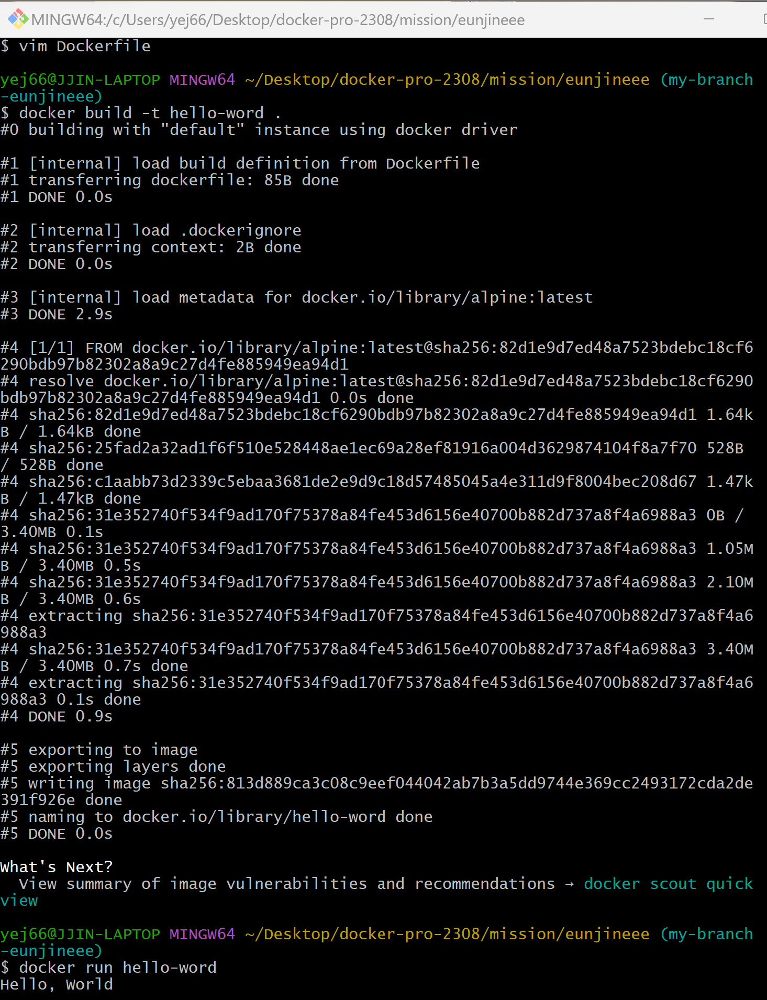

### 1. 컨테이너 기술이란 무엇입니까? (100자 이내로 요약)

실행 중인 컴퓨터의 호스트 운영체제에 격리된 공간을 설정하고, 이 격리 공간 내에 호스트 운영체제로부터 독립된 프로세스를 실행시키는 기술과 이를 위한 소프트웨어 구성 일체

### 2. 도커란 무엇입니까? (100자 이내로 요약)

컨테이너 기반의 오픈소스 가상화 플랫폼으로 리눅스의 응용 프로그램들을 소프트웨어 컨테이너 안에 배치하는 일을 자동화하는 오픈 소스 프로젝트

### 3. 도커 파일, 도커 이미지, 도커 컨테이너의 개념은 무엇이고, 서로 어떤 관계입니까?

### 

#### 도커 파일 (Docker file)

이미지를 어셈블하기 위해 사용자가 명령줄에서 호출할 수 있는 모든 명령을 포함하는 텍스트 문서이다.

#### 도커 이미지  (Docker Image)

애플리케이션을 압축하고 전송하기 위해 Docker는 필요한 격리된 환경과 애플리케이션을 포함하는 파일인 "Docker 이미지"를 사용한. 런타임 환경을 위한 일종의 템플릿이다.

#### 도커 컨테이너 (Docker Container)

Docker가 해당 이미지를 실행해야 하는 경우 이미지를 기반으로 컨테이너를 생성한다.
이미지가 읽기 전용이기 때문에 컨테이너는 이미지의 모든 읽기 전용 레이어(여러 컨테이너에서 공유 가능)와 런타임용 쓰기 가능 레이어(모든 컨테이너에 대해 고유함)가 있는 런타임이다.
컨테이너의 내용은 미리 정의할 수 없으며 나중에 응용 프로그램의 일부 로그 또는 PID 등을 포함할 수 있다. 새 컨테이너가 시작되면 쓰기 가능한 새 레이어가 생성된다 (위 그림에서 이미 설명한 것처럼).

이 개념은 환경이 모든 호스트 시스템에 대해 동일하도록 보장하므로 개발, 테스트 및 생산 간에 추적 및 교환이 가능하다.
프로덕션에서 문제가 발생한 경우 동일한 이미지와 동일한 구성으로 개발에서 재현할 수 있다.

#### 각각의 연관성?

도커파일(Dockerfile)의 명령으로 이미지가 생성된다.

도커가 해당 이미지를 실행해야 하는 경우, 이미지를 기반으로 컨테이너를 생성한다.

이미지는 템플릿일 뿐이므로 시작하거나 실행할 수 없으나, 컨테이너는 실행중인 이미지이다.

### 4. [실전 미션] 도커 설치하기

