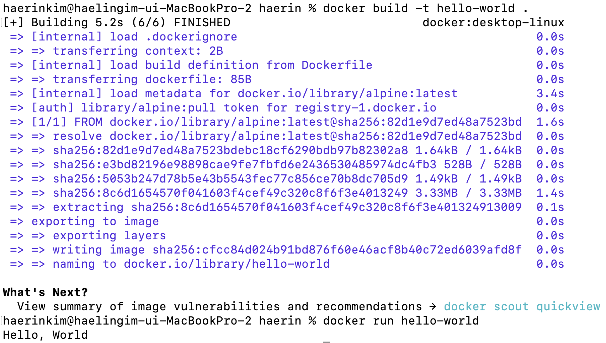

## 사전 미션

1. 컨테이너 기술 : 호스트 OS상에 논리적인 구획(=컨테이너)를 만들고, 애플리케이션을 작동시키기 위해 필요한 라이브러리, 애플리케이션 등을 하나로 모아 별도의 서버인 것처럼 사용할 수 있게 만든 것

2. 도커 : 컨테이너 기술을 사용하여 다양한 환경에서 애플리케이션 실행 환경을 구축 및 운용하기 위한 오픈소스 플랫폼

3. 도커 파일, 도커 이미지, 도커 컨테이너 개념
    1. 도커 파일 : Docker에서 이미지를 생성하기 위해 작성하는 파일 (만들 이미지에 대한 정보를 기술해 둔 템플릿)
    2. 도커 이미지 : 서비스 운영에 필요한 서버 프로그램, 소스 코드 및 라이브러리, 컴파일 된 실행 파일을 묶은 형태 → 특정 프로세스를 실행하기 위한 모든 파일과 설정값을 지닌 것
    3. 도커 컨테이너 : 이미지를 실행한 상태

4. 도커 설치 완료