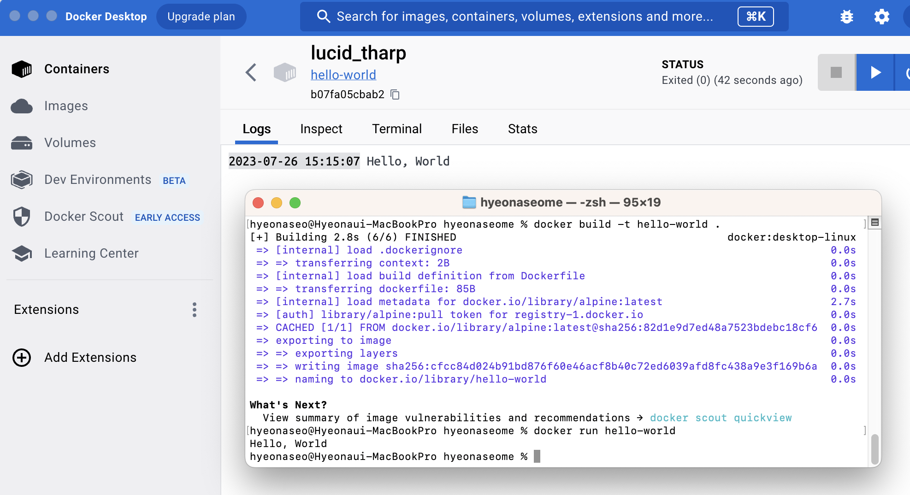

## 1. 컨테이너 기술이란 무엇입니까? (100자 이내로 요약)
> 컨테이너는 소프트웨어 서비스를 실행하는 데 필요한 특정 버전의 프로그래밍 언어 런타임 및 라이브러리와 같은 종속 항목과 애플리케이션 코드를 함께 포함하는 경량 패키지입니다.

## 2. 도커란 무엇입니까? (100자 이내로 요약)
> 도커(Docker)는 리눅스의 응용 프로그램들을 프로세스 격리 기술들을 사용해 컨테이너로 실행하고 관리하는 오픈 소스 프로젝트입니다.

## 3. 도커 파일, 도커 이미지, 도커 컨테이너의 개념은 무엇이고, 서로 어떤 관계입니까?
- 도커 파일: 
     docker에서 이용하는 이미지를 기반으로 하여 새로운 이미지를 스크립트 파일을 통해 내가 설정한 나만의 이미지를 생성할 수 있는 일종의 이미지 설정파일입니다.
- 도커 이미지 :
    파일로 어플리케이션 실행에 필요한 독립적인 환경을 포함하며, 런타임 환경을 위한 일종의 템플릿입니다. 도커 이미지는 소스 코드, 라이브러리, 종속성, 도구 및 응용 프로그램을 실행하는데 필요한 기타 파일을 포함하는 불변(변경 불가) 파일입니다.
- 도커 컨테이너:
    애플리케이션의 모든 코드 및 종속성을 표준 형식으로 패키징할 수 있게 해주는 컨테이너입니다. 

> Dockerfile --(Build)--> Image --(Create)--> Container
 

Dockerfile은 도커 이미지를 빌드하는 방법을 정의하는 스크립트이다.

Docker에서는 환경 정보를 저장하는 파일을 Dockerfile이라고 한다. 이 Dockerfile에는 컨테이너의 구동에 필요한 정보가 작성되어 있다.

Docker file을 빌드해서 이미지를 생성한다.

이미지는 특정 환경에 대한 정보가 변하지 않고 저장되는 정적인 형태의 파일이다.

이미지를 동적인 형태로 변경한 것이 컨테이너이며, 컨테이너가 구동된다는 것은 우리가 필요로 하는 OS와 특정 환경이 경량 가상화로 구현된다는 것을 의미한다. 컨테이너는 어플리케이션을 실행할 격리된 환경이다.

(참조: [블로그](https://sunrise-min.tistory.com/entry/Docker-Container%EC%99%80-Image%EB%9E%80-%EB%AC%B4%EC%97%87%EC%9D%B8%EA%B0%80))

## 4. [실전 미션] 도커 설치하기 (참조: [도커 공식 설치 페이지](https://docs.docker.com/engine/install/))

