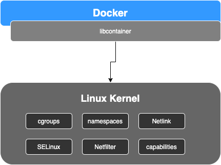
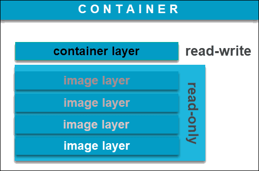
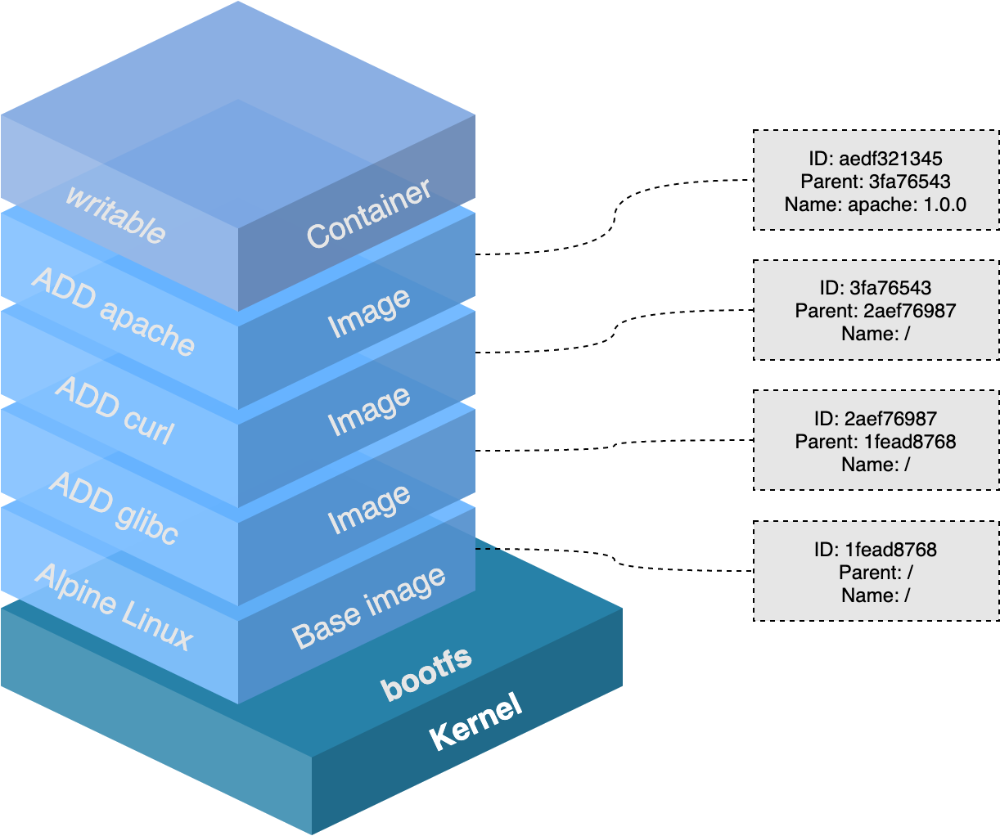
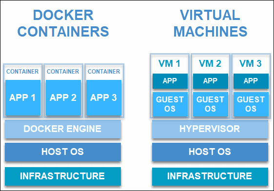
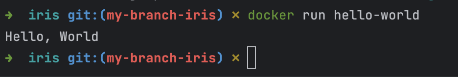

# 1. 컨테이너 기술이란 무엇입니까?
컨테이너는 실행에 필요한 모든 파일을 포함한 전체 실행(runtime) 환경에서 애플리케이션을 패키징하고 격리할 수 있는 기술이다.
이를 통해 전체 기능을 유지하면서 컨테이너화된 애플리케이션을 환경(개발, 테스트, 생산 등) 간에 쉽게 이동할 수 있다.

컨테이너는 IT 보안의 중요한 부분이기도 하다.
컨테이너 파이프라인에 보안을 구축하고 인프라를 보호하여 컨테이너의 안정성, 확장성, 신뢰성을 보장할 수 있다.

또한 일관된 행동과 기능으로 퍼블릭, 프라이빗, 하이브리드 클라우드 환경과 데이터센터(또는 온프레미스) 간에 컨테이너화된 애플리케이션을 손쉽게 이동할 수 있다.

# 2. 도커란 무엇입니까?
"Docker(도커)"는 오픈소스 커뮤니티 프로젝트, 오픈소스 프로젝트 툴, 해당 프로젝트를 주로 지원하는 기업인 Docker Inc. 및 해당 기업이 공식 지원하는 툴을 포함해 여러 의미를 뜻한다.

IT 소프트웨어 "Docker"는 Linux® 컨테이너를 만들고 사용할 수 있도록 하는 컨테이너화 기술이다.
Docker를 사용하면 컨테이너를 매우 가벼운 모듈식 가상 머신처럼 다룰 수 있다.
또한 컨테이너를 구축, 배포, 복사하고 한 환경에서 다른 환경으로 이동하는 등 유연하게 사용할 수 있어, 애플리케이션을 클라우드에 최적화하도록 지원한다.



# 3. 도커 파일, 도커 이미지, 도커 컨테이너의 개념은 무엇이고, 서로 어떤 관계입니까?
## 도커 파일
Dockerfile은 도커 이미지를 빌드하는 방법을 정의하는 스크립트이다. 

Docker에서는 환경 정보를 저장하는 파일을 Dockerfile이라고 한다.
이 Dockerfile에는 컨테이너의 구동에 필요한 정보가 작성되어 있다.

## 도커 이미지
Application을 포장 및 전송하기 위해 도커는 "docker image"를 사용한다.

Docker image는 파일로 어플리케이션 실행에 필요한 독립적인 환경을 포함하며, 런타임 환경을 위한 일종의 템플릿이다.
도커 이미지는 소스 코드, 라이브러리, 종속성, 도구 및 응용 프로그램을 실행하는데 필요한 기타 파일을 포함하는 불변(변경 불가) 파일이다.

이미지는 읽기 전용이므로 스냅샷이라고도 하며, 특정 시점의 애플리케이션과 가상 환경을 나타낸다.
이러한 일관성은 도커의 큰 특징 중 하나로 개발자가 안정적이고 균일한 조건에서 소프트웨어를 테스트하고 실험할 수 있도록 한다.

이미지는 템플릿일 뿐이므로 시작하거나 실행할 수 없다. 컨테이너는 실행 중인 이미지일 뿐이기 때문이다.
컨테이너를 생성하면 쓰기 가능한 레이어가 immutable image(불변 이미지) 위에 추가된다. 즉, 컨테이너는 수정이 가능하다.
컨테이너를 생성하는 이미지 베이스는 별도로 존재하며 변경할 수 없다.

컨테이너 환경을 실행할 때는 기본적으로 컨테이너 내부에 해당 파일 시스템(도커 이미지)의 읽기-쓰기 복사본을 만든다.
이렇게 하면 이미지 전체 복사본을 수정할 수 있는 컨테이너 레이어가 추가된다.



하나의 베이스 이미지에서 도커 이미지를 무제한으로 생성할 수 있다.
이미지의 초기 상태를 변경하고 기존 상태를 저장할 때마다 추가 레이어가 있는 새 템플릿을 만든다.
따라서 도커 이미지는 여러 개의 레이어로 구성될 수 있으며, 각각은 다르지만 이전 레이어에서 비롯된다.

이미지 계층은 컨테이너 계층을 사용하여 가상 환경을 시작할 때 추가된 읽기 전용 파일을 나타낸다.



```bash
# Docker image creation
docker build -t=myimage .
```

## 도커 컨테이너
사용자가 기본 시스템에서 애플리케이션을 분리할 수 있는 가상화된 런타임 환경이다.
이러한 컨테이너는 응용 프로그램을 빠르고 쉽게 시작할 수 있는 portable units 이다.

중요 기능은 컨테이너 내부에서 실행되는 컴퓨팅 환경의 표준화다. 응용 프로그램이 동일한 환경에서 작동하도록 할 뿐 아니라 다른 사람과의 공유도 단순화한다.

컨테이너는 자율적(autonomous)이기 때문에 strong isolation을 제공하며 서로 방해하지 않는다. (격리)

하드웨어 수준에서 가상화가 이루어지는 VM과 달리 컨테이너는 애플리케이션 계층에서 가상화된다.
하나의 머신을 활용하고 커널을 공유하며 분리된 프로세스를 실행하기 위한 운영 체제를 가상화할 수 있다.
따라서 컨테이너가 매우 가벼워져 리소스를 많이 사용하지 않을 수 있다.



```bash
# Docker container creation
docker run -d --name mycontainer -p 8080:8080 myimage
```

## 도커 파일, 도커 이미지, 도커 컨테이너의 관계성
>Dockerfile --(Build)--> Image --(Create)--> Container

Docker file을 빌드해서 이미지를 생성한다.
이미지는 특정 환경에 대한 정보가 변하지 않고 저장되는 정적인 형태의 파일이다.

이미지를 동적인 형태로 변경한 것이 컨테이너이며, 컨테이너가 구동된다는 것은 우리가 필요로 하는 OS와 특정 환경이 경량 가상화로 구현된다는 것을 의미한다. 컨테이너는 어플리케이션을 실행할 격리된 환경이다.

다시 말하면 컨테이너를 생성하는 것은 다른 환경과 분리시킨 환경을 만든다는 말이고, 컨테이너를 구동하는 것은 분리된 프로세스화하여 특정 환경을 만드는 것이다.

# 4. [실전 미션] 도커 설치하기

