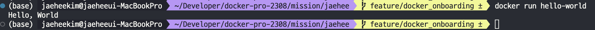

# 사전 미션
## 1. 컨테이너 기술이란 무엇입니까? (100자 이내로 요약)
- 컨테이너는 실행에 필요한 모든 파일을 포함한 전체 실행환경에서 애플리케이션을 패키징하고 격리할 수 있는 기술입니다. 

## 2. 도커란 무엇입니까? (100자 이내로 요약)
- 도커는 컨테이너 기반의 가상화 플랫폼으로, 애플리케이션을 소프트웨어 컨테이너 안에 패키징하여 실행하는 오픈 소스 기술입니다. 

## 3. 도커 파일, 도커 이미지, 도커 컨테이너의 개념은 무엇이고, 서로 어떤 관계입니까?
- **도커 파일**은 도커 파일은 도커 이미지를 만들기 위한 빌드 지시사항들을 기술한 텍스트 파일입니다. 일종의 레시피로 볼 수 있습니다. 도커 파일은 사용자가 커스텀 애플리케이션 또는 서비스를 구성하는 방법을 정의합니다.
- **도커 이미지**는 도커 이미지는 도커 파일에 기반하여 만들어진 응용 프로그램과 해당 응용 프로그램을 실행하는 데 필요한 모든 것을 포함하는 가볍고 독립적인 실행 가능한 패키지입니다.
- **도커 컨테이너**는 도커 컨테이너는 도커 이미지를 실행한 상태로, 애플리케이션과 해당 애플리케이션을 실행하는데 필요한 모든 종속성 및 환경 설정을 포함합니다.

## 4. [실전 미션] 도커 설치하기 (참조: 도커 공식 설치 페이지)

