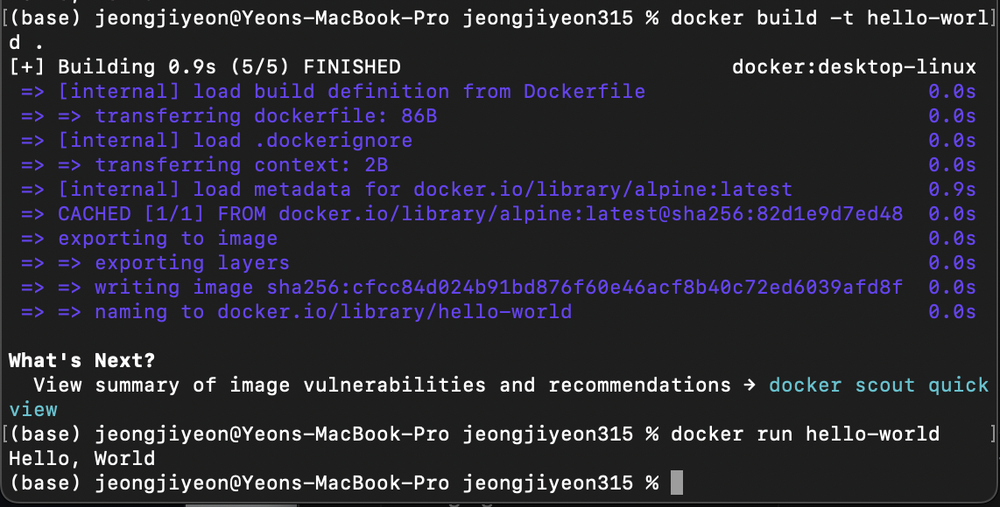

1. 컨테이너 기술이란 무엇입니까? (100자 이내로 요약)
- 컨테이너란 애플리케이션을 환경에 구애 받지 않고 실행하는 기술이다. 운영체제에서 실행되는 여러 프로세스는 컨테이너라는 개념으로 격리되어 별도의 운영 환경을 제공해주는 기술이다. 
2. 도커란 무엇입니까? (100자 이내로 요약)
- 도커는 컨테이너 기반의 오픈소스 가상화 플랫폼이다. 계속 바뀌는 서버 환경과 개발 환경 문제를 해결하기 위해 등장했으며, 도커가 등장하고 서버관리/개발 방식이 편리하게 바뀌었다.
3. 도커 파일, 도커 이미지, 도커 컨테이너의 개념은 무엇이고, 서로 어떤 관계입니까?
- 도커 파일은 도커 이미지를 빌드하는 방법을 정의하는 스크립트이며 도커파일에는 컨테이너의 구동에 필요한 정보가 작성되어 있다. 도커 이미지는 파일로 어플리케이션 실행에 필요한 독립적인 환경을 포함하며, 런타임 환경을 위한 일종의 템플릿이다. 도커 컨테이너는 사용자가 기본 시스템에서 애플리케이션을 분리할 수 있는 가상화된 런타임 환경이다.
도커 파일에는 컨테이너의 구동에 필요한 정보가 작성되어있으며, 도커 파일을 빌드해서 도커 이미지를 생성하며 이 이미지는 특정 환경에 대한 정보가 변하지 않고 저장되는 정적인 형태의 파일이다. 이 이미지를 동적인 형태로 변경한 것이 도커 컨테이너이다.

4. [실전 미션] 도커 설치하기 (참조: [도커 공식 설치 페이지](https://docs.docker.com/engine/install/))
