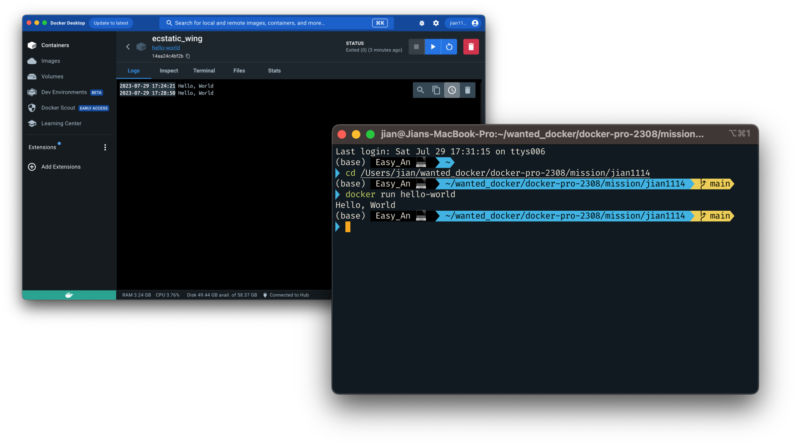

# 1. 컨테니어 기술이란 무엇입니까?
앱을 실행하는데 필요한 것들을 포함한 상자라고 생각할 수 있다. 
앱 실행 시 필요한 코드,시스템 도구,라이브러리 등이 모두 포함되어 있어 언제 어디서나 동일하게 작동이 가능하다.

# 2. 도커란 무엇입니까?
컨테이너 기술을 이용하여 앱을 신속하게 만들고 배포할 수 있는 오픈소스 플랫폼이다. 
개발부터 배포, 실행까지 일관되게 관리하고 확장성을 높인다.

# 3. 도커 파일, 도커 이미지, 도커 컨테이너의 개념은 무엇이고, 서로 어떤 관계입니까?
### 1) 도커 파일
애플리케이션과 필요한 여러 환경들에 대한 설정 정의가 들어있는 파일

### 2) 도커 이미지
컨테이너를 실행하는데 필요한 코드, 라이브러리 등을 담고 있는 파일

### 3) 도커 컨테이너
'도커 이미지'가 하나의 인스턴스로 실행된 것

### 결론
'도커 파일'을 이용해 '도커 이미지'가 생성되고, 이 '도커 이미지'를 바탕으로 '도커 컨테이너'를 실행한다.  
즉, 도커 이미지는 설계도와 비슷하고 도커 컨테이너는 실체라고 할 수 있다.

# 4.[실전미션] 도커 설치하기
