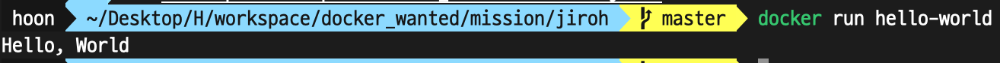

1. 컨테이너 기술이란 무엇입니까? (100자 이내로 요약)

애플리케이션을 독립적으로 실행하고 배포하기 위한 가벼운 가상화 기술입니다. 컨테이너는 애플리케이션과 해당 종속성을 격리된 환경에 패키징하여 이식성과 확장성을 향상시킵니다. 이를 통해 개발자는 애플리케이션을 여러 환경에서 일관되게 실행할 수 있고, 더욱 효율적인 개발, 배포, 운영이 가능해집니다.

2. 도커란 무엇입니까? (100자 이내로 요약)

컨테이너 기반 가상화 플랫폼으로, 애플리케이션과 종속성을 격리된 환경인 컨테이너로 패키징하여 효율적인 배포와 실행을 가능하게 합니다. 도커는 애플리케이션 개발과 운영을 단순화하며, 이식성과 확장성을 높여 개발자들에게 혁신적인 개발 경험을 제공합니다.

3. 도커 파일, 도커 이미지, 도커 컨테이너의 개념은 무엇이고, 서로 어떤 관계입니까?

도커 파일(Dockerfile)은 도커 이미지를 구축하기 위한 지침을 포함한 텍스트 파일입니다. 도커 이미지는 독립적으로 실행될 수 있는 패키지로, 애플리케이션과 해당 종속성, 실행 환경 등을 포함합니다. 도커 컨테이너는 도커 이미지의 인스턴스로, 실행 중인 애플리케이션입니다. 도커 파일은 도커 이미지를 구성하는 데 사용되고, 도커 이미지는 도커 컨테이너를 생성하고 실행하는 데 사용됩니다. 따라서 도커 파일은 도커 이미지를 만들기 위한 설계도이고, 도커 이미지는 도커 컨테이너의 실행을 위한 템플릿입니다.

[실전 미션] 도커 설치하기 (참조: 도커 공식 설치 페이지)

아래 도커 설치부터 실행 튜토리얼을 참조하여 도커를 설치하고, 도커 컨테이너를 실행한 화면을 캡쳐해서 Pull Request에 올리세요.

