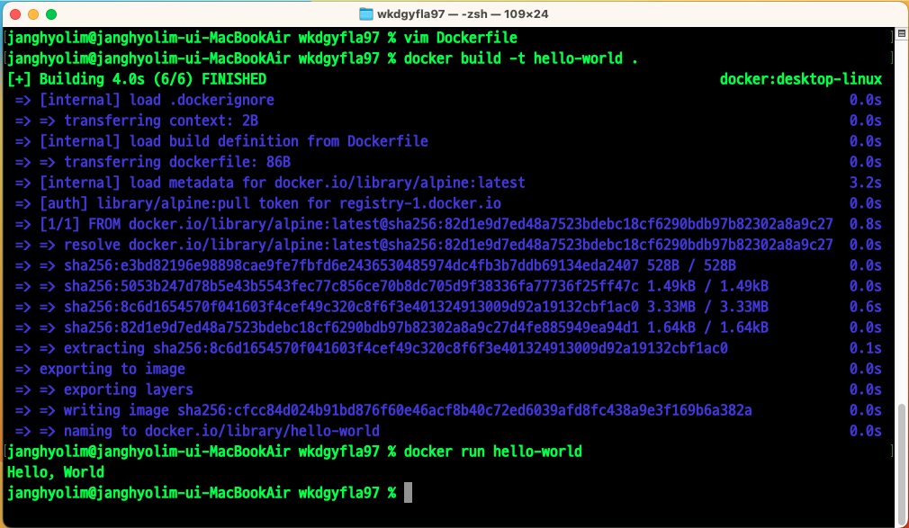

# 사전미션
## 1. 컨테이너 기술이란 무엇입니까?(100자 이내로 요약)
소프트웨어 서비스를 실행하는 데 필요한 특정 버전의 프로그래밍 언어 런타임 및 라이브러리와 같은 종속항목과 애플리케이션 코드를 격리된 환경에 함께 포함하여 애플리케이션을 가볍고 이식성 높은 패키지로 만드는 기술입니다.


## 2. 도커란 무엇입니까?(100자 이내로 요약)
도커는 소프트웨어 실행에 필요한 모든 구성 요소를 포함하는 컨테이너로 애플리케이션을 패키징하며 코드, 런타임, 라이브러리, 시스템 도구 등을 포함합니다. 이러한 컨테이너를 통해 애플리케이션은 언제나 동일하게 실행됩니다.

## 3. 도커 파일, 도커 이미지, 도커 컨테이너의 개념은 무엇이고, 서로 어떤 관계입니까?
```
    DockerFile -> (build) -> Image -> (Create) -> Container
```
도커 파일: 도커 이미지를 빌드하는 방법을 정의하는 스크립트입니다. 컨테이너 내부에서 실행할 애플리케이션에 필요한 소스코드, 의존성, 설정 등이 정의되어 있으며, 이미지를 생성하는데 필요한 단계와 명령어를 순차적으로 기술합니다.

도커이미지: 도커파일을 빌드한 결과물로, 애플리케이션 실행에 필요한 요소들이 포함된 패키지입니다. 변경 불가능한 구조로 구성되어있으며, 컨테이너를 실행하는 데 사용됩니다. 여러 개의 컨테이너를 생성하는 데 사용되므로 도커 이미지는 애플리케이션의 휴대성과 확장성을 제공합니다.

도커 컨테이너: 가상화된 런타임 환경으로, 애플리케이션을 분리해 실행하여 쉽고 빠르게 시작할 수 있도록 합니다. 컨테이너 내부에서 실행되는 컴퓨팅 환경을 표준화하여 동일한 환경에서 작동하고 공유가 간편하며, 자율적이고 격리된 실행을 제공합니다. 하나의 머신에서 커널을 공유하고 운영체제를 가상화하여 분리된 프로세스를 실행할 수 있습니다.

## 4. [실전 미션] 도커 설치하기

```
아래 "도커 설치부터 실행 튜토리얼"을 참조하여 도커를 설치하고, 도커 컨테이너를 실행한 화면을 캡쳐하여 Pull Request에 올리세요.
```