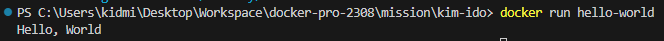

## 사전 미션

### 1. 컨테이너 기술이란 무엇입니까? (100자 이내로 요약)
컨테이너 기술은 애플리케이션과 그에 필요한 모든 종속성을 독립된 환경에 담아서 실행할 수 있도록 돕습니다. 결과적으로 애플리케이션의 이식성과 확장성을 크게 향상시킵니다.

### 2. 도커란 무엇입니까? (100자 이내로 요약)
도커는 컨테이너 기술을 활용하여 애플리케이션을 더 쉽게 개발, 배포, 운영할 수 있도록 도와주는 플랫폼이며, 컨테이너를 만들고 실행하기 위한 도구와 라이브러리를 제공합니다.

### 3. 도커 파일, 도커 이미지, 도커 컨테이너의 개념은 무엇이고, 서로 어떤 관계입니까?
- 도커 파일은 도커 이미지를 만들기 위한 설정 스크립트입니다. 일종의 빌드 스크립트로서, 컨테이너 안에서 실행될 애플리케이션과 그에 필요한 종속성, 환경 설정 등을 명시합니다. 주로 기반 이미지를 선택하고, 추가적인 패키지 설치, 소스 코드 복사, 환경 변수 설정 등이 이루어집니다.

- 도커 이미지는 도커 파일을 바탕으로 빌드된 실행 가능한 패키지입니다. 이미지는 애플리케이션과 그 실행에 필요한 모든 것들을 담고 있으며, 컨테이너를 생성하는 데 사용됩니다. 기본적으로 읽기 전용 파일 시스템으로, 도커 이미지를 사용해 동일한 환경에서 여러 개의 컨테이너를 생성할 수 있습니다.

- 도커 컨테이너는 도커 이미지를 기반으로 실행된 실제 인스턴스입니다. 컨테이너는 이미지를 실행한 상태로서 격리된 환경에서 동작하며, 호스트 시스템과는 독립적입니다. 각 컨테이너는 자체 파일 시스템, 네트워크, 프로세스 공간 등을 갖고 있어 독립적인 실행 환경을 제공합니다.

- 도커 파일은 도커 이미지를 생성하는 데 사용되며, 이미지는 컨테이너를 실행하는 데 사용됩니다.

### 4. [실전 미션] 도커 설치하기
