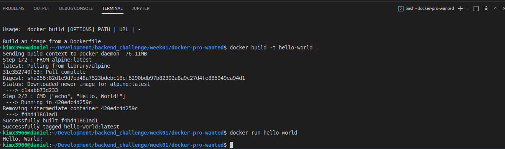

# 사전 미션
## 1. 컨테이너 기술이란 무엇입니까? (100자 이내로 요약)
컨테이너는 운영 체제 가상화의 한 형태입니다.컨테이너 내부에는 필요한 모든 실행 파일, 바이너리 코드, 라이브러리 및 구성 파일이 들어 있습니다. 서버 또는 머신 가상화 접근 방식과 달리 컨테이너에는 운영 체제 이미지가 포함되어 있지 않습니다. 그렇기 때문에 더 가볍고 휴대성이 좋으며 오버헤드가 현저히 낮습니다.  

---

## 2. 도커란 무엇입니까? (100자 이내로 요약)
도커는 컨테이너 기술을 기반으로 한 일종의 가상화 플랫폼입니다. 즉, 컨테이너를 잘 다룰 수 있게 도와 주는 도구입니다. 도커는 독립된 환경을 만들어서 하드웨어를 효율적으로 활용할 수 있게 만듭니다. 개발 과정에서 다른 라이브러리와 충돌하는 것을 방지하기 위해 격리된 환경이 필요할 때, 완성된 서비스를 배포할 때, 혹은 배포 중인 서비스를 받아서 실행해 볼 때도 유용합니다. 

---

## 3. 도커 파일, 도커 이미지, 도커 컨테이너의 개념은 무엇이고, 서로 어떤 관계입니까?
i) 도커 파일은 도커 이미지를 빌드하는데 필요한 명령어를 순서대로 기술한 텍스트 파일입니다.
컨테이너에 설치해야 하는 패키지, 추가해야 하는 소스코드, 실행해야 하는 명령어와 쉘 스크립트 등을 기록한 파일입니다.

ii) 도커 이미지는 파일로 어플리케이션 실행에 필요한 독립적인 환경을 포함하며, 런타임 환경을 위한 일종의 템플릿입니다. 도커 이미지는 소스 코드, 라이브러리, 종속성, 도구 및 응용 프로그램을 실행하는데 필요한 기타 파일을 포함하는 불변(변경 불가) 파일입니다.

ii) 도커 컨테이너는 도커 이미지에 기반한 인스턴스입니다.

---

## 4. [실전 미션] 도커 설치하기 
