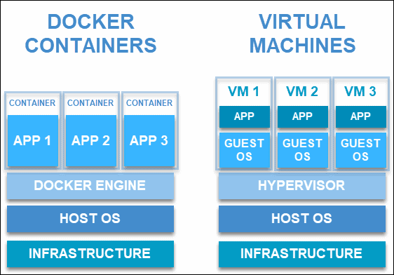

# kungbi 사전 미션

## 컨테이너 기술이란 무엇입니까? (100자 이내로 요약)
애플리케이션을 개발하고 배포를 할 때 환경이 바뀌게 된다. 환경마다 네트워크 기술과 보안 정책, 스토리지, 라이브리 버전 등 신경을 써야할 것들이 한 두개가 아니다. 개발자도 사람인지라 놓치는 부분이 있고 이 때문에 예상치 않은 에러가 발생하게 된다. 컨테이너 기술은 애플리케이션 실행에 필요한 라이브러리, 바이너리 및 구성 파일 들을 컨테이너로 묶어서 배포해준다. 그래서 이전보다 더 빠르고 간편하게 배포할 수 있게 되었다.

---

## 도커란 무엇입니까? (100자 이내로 요약)
컨테이너를 위한 운영체제 이다. 가상머신이 서버에 작동되는 원리가 같다. 도커 위에 컨테이너가 작동되는 방식이다. 컨테이너는 운영체제를 포함하고 있지 않아서 파일이 굉장히 작다(가상머신에 비해). 그래서 가상머신 자체를 이동하는 것보다 훨신 효율적이다. 

---

## 도커 파일, 도커 이미지, 도커 컨테이너의 개념은 무엇이고, 서로 어떤 관계입니까?
### 도커 파일
Dockerfile은 도커 이미지를 빌드하는 방법을 정의하는 스크립트 이다. Dockerfile로 이미지를 생성할 수 있다. Dockerfile에는 여러 정보를 기입하여 환경을 구성할 수 있다.

### 도커 이미지
도커 이미지는 소스 코드, 라이브러리, 종속성, 도구 및 응용 프로그램을 실행하는데 필요한 기타 파일을 포함하는 불변 파일이다. 도커 이미지는 스냅샷이라고도 하며, 특정 시점의 애플리케이션과 가상 환경을 타나낸다. 

컨테이너에서 작업을 하다가 배포를 하기 위해서 이미지로 패키징 하여 배포를 할 수 있다.

### 도커 컨테이너
컨테이너는 응용프로그램을 빠르고 쉽게 시작할 수 있는 portable unit 이다.

컨테이너들은 자율적이기 때문에 서로 방해하지 않는다. 하드웨어 수준에서 가상화가 이루어지는 VM과 달리 컨테이너는 애플리케이션 계층에서 가상화 된다.

마치 JVM과 같이 OS위에 가상환경위에 돌아가는 여러 컨테이너가 존재하는 것이다.

하나의 머신을 활용하여 커널을 공유하며 분리된 프로세스를 실항하기 위한 운영 체제를 가상화 할 수 있다. 때문에 컨테이너가 매우 가벼워져 리소스를 효율적으로 사용할 수 있다.

