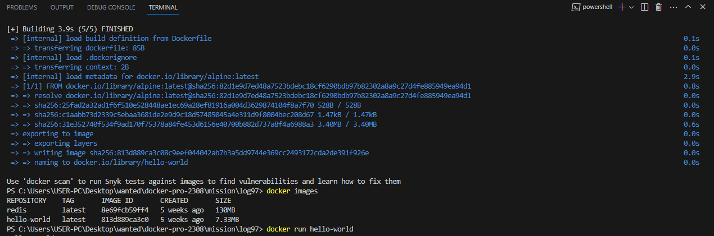

## 컨테이너 기술이란 무엇입니까? (100자 이내로 요약)

컨테이너 기술은 컨테이너라는 격리된 독립적인 공간을 만들고 별도의 서버처럼 사용하는 방식으로, 실행에 필요한 라이브러리와 바이너리 등은 이미지 단위로 빌드하여 패키지로 배포합니다.  

 

## 도커란 무엇입니까? (100자 이내로 요약)

도커는 컴퓨팅 리소스 가상화 기술로 기존에 별도의 개별 OS가 필요한 하이퍼바이저 가상화 방식의 단점을 보완하기 위해 컨테이너를 이용한 방식의 가상화 방식입니다.  

 

## 도커 파일, 도커 이미지, 도커 컨테이너의 개념은 무엇이고, 서로 어떤 관계입니까?

**도커 컨테이너**는 개별로 격리된 실행 환경으로 볼 수 있습니다. 이러한 컨테이너는 이미지 단위로 빌드하여 실행되게 됩니다.  

**도커 이미지**는 여러 개의 이미지 레이어가 모여 하나의 이미지 파일로 만들어질 수 있는데, 애플리케이션 코드, 라이브러리, 실행 환경, 설정 등이 모두 포함되어 도커 컨테이너는 이 이미지를 기반으로 애플리케이션을 배포할 수 있습니다.  

**도커 파일**은 도커 이미지를 생성하기 위한 설정 파일로 애플리케이션의 실행 환경과 의존성을 스크립트로 정의하여 해당 파일을 빌드하여 도커 이미지로 변환할 수 있습니다. 기존에 도커 CLI 명령을 통해 컨테이너화 하기전에 실행 환경에 대한 옵션 등을 명시할 수 있지만, 도커 파일을 통해 스크립트로 다양한 옵션을 쉽게 지정할 수 있습니다. 이렇게 실행 환경에 대한 옵션이 적용된 이미지를 빌드하여 하나의 이미지로 만들 수 있습니다.  

 

**세 개의 개념에 대한 관계**로는 도커는 컨테이너라는 격리된 공간으로 실행하며, 이러한 컨테이너는 이미지 단위로 빌드하여 실행하게 된다.  
도커 이미지에는 실행에 필요한 코드, 라이브러리, 환경 등이 포함되어 있으며 실행시 다양한 옵션을 줄 수 있다.  
이러한 이미지는 도커 파일을 통해 고유한 문법으로 보기 쉬운 스크립트로 정의할 수 있는데, 정의된 도커 파일을 빌드하여 별도의 도커 이미지를 만들어 특정 라이브러리 및 실행 환경 옵션이 설정된 이미지로 컨테이너화하여 배포할 수 있다.  
 - 즉, 도커 컨테이너는 실행 환경을 말하고, 도커 이미지는 하나의 애플리케이션으로 볼 수 있고, 도커 파일을 통해 다양한 레이어를 결합한 도커 이미지를 쉽게 관리하여 만들 수 있다.
 - 도커 파일을 통해 다양한 레이어를 결합한 이미지를 빌드하여, 도커 컨테이너안에서 해당 이미지(하나의 애플리케이션)를 실행할 수 있다.

 

## [실전 미션] 도커 설치하기

    

