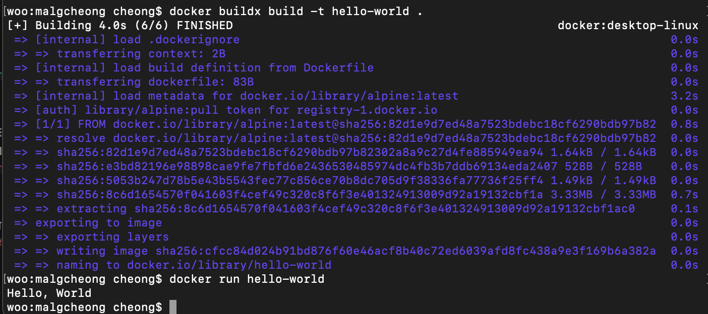

1. 컨테이너 기술이란 무엇입니까? (100자 이내로 요약)
컨테이너란 호스트 OS상에 논리적인 구획(컨테이너)을 만들고, 어플리케이션을 작동시키기 위해 필요한 라이브러리나 어플리케이션 등을 하나로 모아, 별도의 서버인 것처럼 사용할 수 있게 만든 것

2. 도커란 무엇입니까? (100자 이내로 요약)
Go언어로 작성된 리눅스 컨테이너 기반으로 하는 오픈소스 가상화 플랫폼이다. 도커 컨테이너들이 도커 엔진 위에서 실행되기 때문에 실행환경에 상관없이 모든 환경에서 동일하게 작동할 수 있다. 

3. 도커 파일, 도커 이미지, 도커 컨테이너의 개념은 무엇이고, 서로 어떤 관계입니까?
도커 파일은 도커 이미지를 빌드하는 방법을 정의하는 스크립트이다. Docker에서는 환경 정보를 저장하는 파일을 도커 파일이라고 한다. 이 도커 파일에는 컨테이너의 구동에 필요한 정보가 작성되어 있다. Docker file을 빌드해서 이미지를 생성한다.

도커 이미지는 소스 코드, 라이브러리, 종속성, 도구 및 응용 프로그램을 실행하는데 필요한 기타 파일을 포함하는 불변(변경 불가) 파일이다.
이미지는 읽기 전용이므로 스냅샷이라고도 하며, 특정 시점의 애플리케이션과 가상 환경을 나타낸다.

도커 컨테이너는 이미지(Image)를 실행한 상태로, 응용프로그램의 종속성과 함께 응용프로그램 자체를 패키징 or 캡슐화하여 격리된 공간에서 프로세스를 동작시키는 기술이다. 컨테이너는 이미지 Layer에 읽기/쓰기(read-write) Layer를 추가하는 것으로 생성/실행된다. 따라서 여러 개의 컨테이너를 생성해도 최소한의 용량만 사용되며, 바뀐 부분을 읽기/쓰기 Layer에 쓰게된다.

4. [실전 미션] 도커 설치하기 (참조: [도커 공식 설치 페이지](https://docs.docker.com/engine/install/))
- 아래 `도커 설치부터 실행 튜토리얼`을 참조하여 도커를 설치하고, 도커 컨테이너를 실행한 화면을 캡쳐해서 Pull Request에 올리세요.

    

