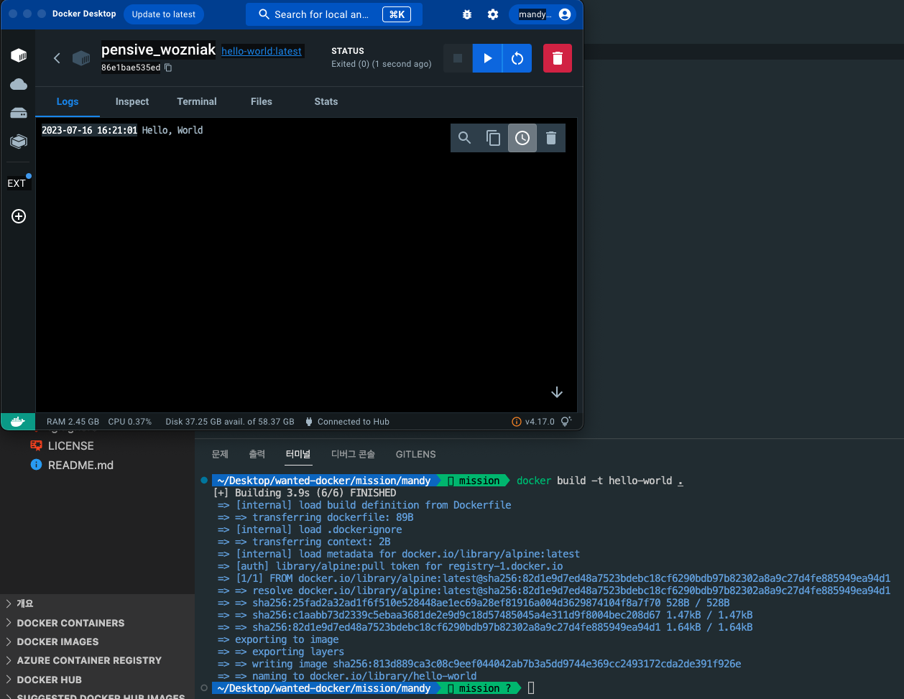

# 사전 미션

## 1. 컨테이너 기술이란 무엇입니까? (100자 이내로 요약)

Docker 컨테이너 기술은 애플리케이션을 격리된 환경에서 실행하고 패키징하는 가상화 기술입니다. 애플리케이션의 개발, 배포 및 실행을 단순화하고 효율적으로 관리할 수 있는 많은 장점을 제공합니다.

## 2. 도커란 무엇입니까? (100자 이내로 요약)

Docker는 컨테이너 기반 가상화 기술을 제공하는 오픈 소스 플랫폼으로, 애플리케이션을 격리된 환경인 컨테이너에 패키징하고 실행할 수 있게 해줍니다. 각 컨테이너는 자체 파일 시스템과 종속성을 갖으며, 호스트 운영 체제와는 독립적으로 실행됩니다.

## 3. 도커 파일, 도커 이미지, 도커 컨테이너의 개념은 무엇이고, 서로 어떤 관계입니까?

1. **도커 파일** : Docker 이미지를 생성하기 위한 설정 파일입니다. Docker 파일은 애플리케이션의 구성, 종속성, 환경 설정 등을 정의하며, Docker 이미지를 빌드하는 데 사용됩니다.

2. **도커 이미지** : Docker 컨테이너를 생성하는 데 사용되는 실행 가능한 패키지입니다. 이미지는 응용 프로그램의 코드, 라이브러리, 실행에 필요한 모든 구성 요소를 포함하고 있습니다. 이미지는 Docker 파일을 기반으로 빌드되며, 여러 개의 이미지를 사용하여 여러 컨테이너를 생성할 수 있습니다

3. **도커 컨테이너** : 독립된 환경에서 실행되는 가상화된 프로세스입니다. 컨테이너는 Docker 이미지를 기반으로 생성되며, 이미지는 여러 개의 컨테이너를 생성하는 데 사용될 수 있습니다. 각 컨테이너는 격리된 파일 시스템과 리소스를 가지며, 호스트 운영 체제와는 독립적으로 실행됩니다.

요약하면, 도커 파일을 사용하여 도커 이미지를 빌드한 후, 해당 이미지를 이용하여 여러 개의 도커 컨테이너를 생성하고 실행할 수 있습니다.

## 4. [실전 미션] 도커 설치하기 (참조: 도커 공식 설치 페이지)

