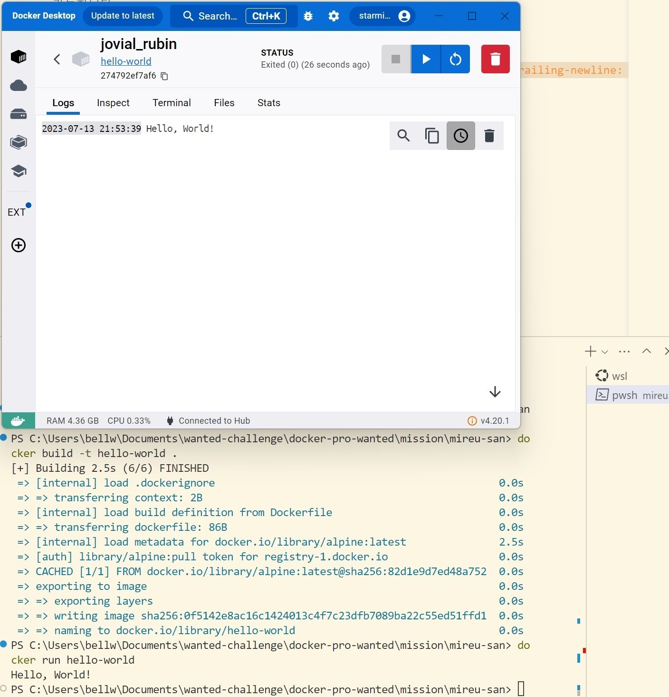

# WANTED 사전 미션 제출

## 1. 컨테이너 기술이란 무엇입니까? (100자 이내로 요약)

Docker에서 제시한 container는 표준, 가벼움, 보안이라는 핵심 가치를 갖고 있으며, 소프트웨어 패키징, 배포, 프로세스 격리를 통해 어디서든 쉽게 실행 가능한 컨테이너 기술을 제공합니다.

## 2. 도커란 무엇입니까? (100자 이내로 요약)

Docker는 container 기술을 주력으로 사용하는 오픈소스 플랫폼입니다. 단순하고 간편한 사용법으로 작업 운영체제와 기술적 제약을 극복하여 독립된 실행 환경에서 구성, 배포, 확장에 특화되었습니다.

## 3. 도커 파일, 도커 이미지, 도커 컨테이너의 개념은 무엇이고, 서로 어떤 관계입니까?

- **도커 파일**은 이미지 빌드를 위한 구성(instruction)을 포함한 텍스트 형태의 파일입니다. 
- **도커 이미지**는 도커 파일을 기반으로 생성 되어, 앱 실행에 필요한 구성을 포함한 패키지(package)입니다. 이미지 자체는 읽기 전용이며, 컨테이너 생성을 위한 일종의 템플릿 역할을 합니다. 
- **도커 컨테이너**는 그 도커 이미지를 기반으로 실행된 프로세스 입니다. 격리(isolation)된 환경에서 앱과 관련한 모든 환경설정(종속성)을 포함함으로서, 독립적인 실행 환경의 실현이 가능합니다.

## 4. [실전 미션] 도커 설치하기 (참조: 도커 공식 설치 페이지)
