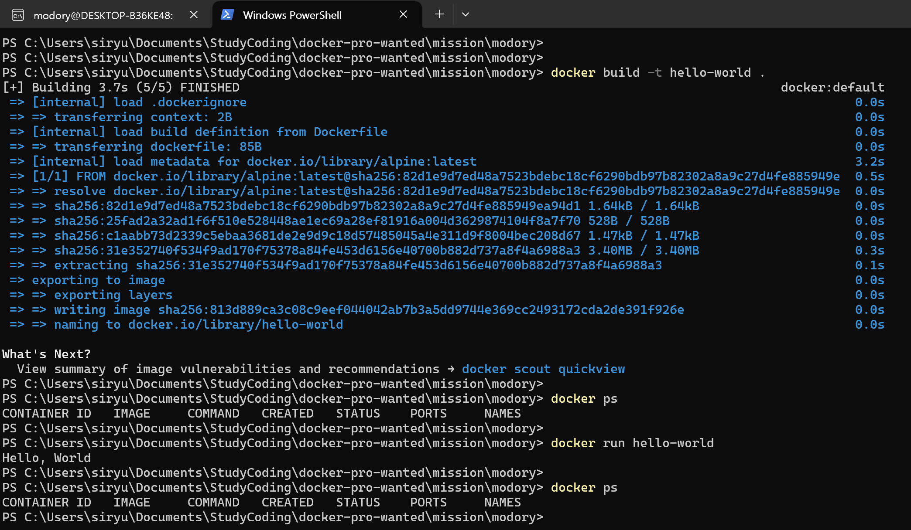

# 1. 컨테이너 기술이란 무엇입니까? (100자 이내로 요약)

컨테이너 기술은 호스트 운영체제 위에 격리된 컴퓨팅 환경을 만듦으로써 호스트 운영체제와 설정 충돌을 최소화합니다. 어플리케이션 실행 목적으로 독립된 운영체제 가상 환경을 구축해주는 기술입니다.

# 2. 도커란 무엇입니까? (100자 이내로 요약)

컨테이너 기술을 활용하여 도커 컨테이너 안에 어플리케이션들을 배치시키는 일을 자동화합니다. 공통된 구동 사양 설정이 가능하므로 개발자들은 각자 개발 환경에 구애받지 않고 개발 및 서버 배포를 좀 더 쉽게 할 수 있습니다.

# 3. 도커 파일, 도커 이미지, 도커 컨테이너의 개념은 무엇이고, 서로 어떤 관계입니까?

## 도커 파일

도커 이미지 생성을 위한 명령어를 담고 있는 파일로 셸스크립트 작성법과 유사하며, 이미지를 토대로 실행될 컨테이너 내부 설정값 등을 담고 있습니다.

## 도커 이미지

도커 파일 기반으로 생성된 것으로, 실행하고자 하는 컨테이너 버전이 확정된 값을 담고 있으며 컨테이너 실행에 필요한 내용을 이미지화하여 가지고 있는 시스템입니다.

## 도커 컨테이너

도커 이미지를 기반으로 생성되며, 호스트 운영체제 위에 실행하고자 하는 어플리케이션만을 위한 독립적인 가상 운영체제가 만들어집니다.

## 서로 어떤 관계인지

도커 컨테이너 생성 및 실행을 위해 버전과 포트포워딩 등의 내용이 확정된 도커 이미지가 필요하고, 도커 이미지 생성을 위해 커맨드라인 명령어 형태로 작성된 도커 파일이 필요합니다. 도커 컨테이너를 구동을 위해 각각 순서별로 필요한 관계입니다.

# 4. [실전 미션] 도커 설치하기 (참조: 도커 공식 설치 페이지)

