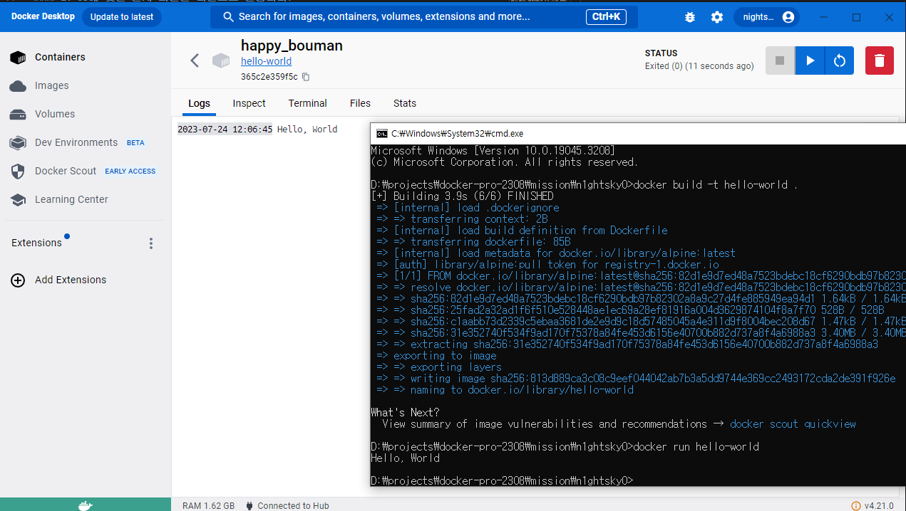

### 1. 컨테이너 기술이란 무엇입니까?

```
컨테이너는 애플리케이션이 한 컴퓨팅 환경에서 다른 컴퓨팅 환경으로 빠르고 안정적으로 실행되도록 코드와 모든 종속성을 패키징하는 소프트웨어의 표준 단위입니다.
```

### 2. 도커란 무엇입니까?

```
Docker는 애플리케이션 개발, 배포 및 실행을 위한 개방형 플랫폼입니다.
```

### 3. 도커 파일, 도커 이미지, 도커 컨테이너의 개념은 무엇이고, 서로 어떤 관계입니까?

```
Dockerfile은 Docker 플랫폼에서 컨테이너를 자동으로 생성하는 스크립트입니다.
Dockerfile은 기본적으로 사용자가 이미지를 어셈블하기 위해 명령줄에서 호출할 수 있는 모든 명령이 포함된 텍스트 문서입니다.

도커 이미지 는 Docker 컨테이너 생성 지침이 포함된 읽기 전용 템플릿입니다.
Dockerfile에 작성된 내용을 따라 이미지가 빌드됩니다.

컨테이너는 이미지의 실행 가능한 인스턴스입니다.
같은 이미지라도 실행 설정에 따라 다른 종류의 컨테이너가 실행됩니다.
```

### 4. [실전 미션] 도커 설치하기

