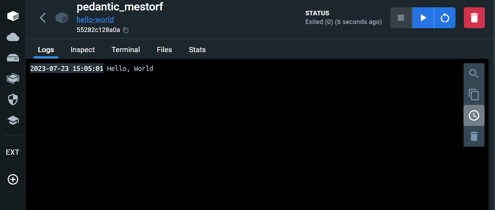

# 1. 컨테이너 기술이란 무엇입니까?

    * 컨테이너 기술은 애플리케이션과 그 실행 환경을 격리된 단위인 컨테이너에 패키징하여 효율적이고 일관된 환경에서 실행하고 배포하는 기술입니다.

# 2. 도커란 무엇입니까?

    * 도커는 컨테이너기반의 오픈 소스 가상화 플랫폼으로, 애플리케이션과 그 실행 환경을 격리된 단위인 도커 컨테이너로 패키징하고, 이를 효율적으로 관리, 배포할 수 있는 기술입니다.

# 3. 도커 파일, 도커 이미지, 도커 컨체이너의 개념은 무엇이고, 서로 어떤 관계입니까?

    * 도커 파일
        도커 파일은 도커 이미지를 생성하기 위한 빌드 설정 파일입니다.

    * 도커 이미지
        도커 이미지는 애플리케이션과 실행 환경을 패키징한 불변의 파일 시스템입니다.

    * 도커 컨테이너
        도커 컨테이너는 도커 이미지의 실행 가능한 인스턴스입니다.

    * 관계
        도커 파일은 도커 이미지를 생성하는 설정 파일로, 도커 이미지는 애플리케이션과 실행 환경을 패키징한 파일 시스템입니다. 도커 이미지를 기반으로 도커 컨테이너가 생성되며, 도커 컨테이너는 실행 가능한 도커 이미지의 인스턴스입니다. 따라서 도커 파일은 도커 이미지를 빌드하기 위한 설정을 제공하고, 도커 이미지는 도커 컨테이너를 생성하고 실행하는데 사용됩니다.

# 4. [실전 미션] 도커 설치하기

