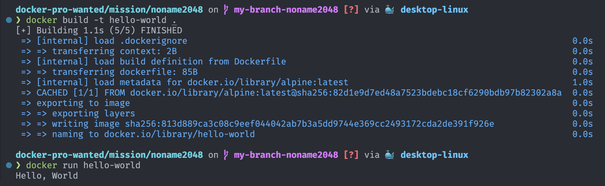

# 👀 사전과제

1. 컨테이너 기술이란 무엇입니까? (100자 이내로 요약)
2. 도커란 무엇입니까? (100자 이내로 요약)
3. 도커 파일, 도커 이미지, 도커 컨테이너의 개념은 무엇이고, 서로 어떤 관계입니까?
4. [실전 미션] 도커 설치하기 (참조: [도커 공식 설치 페이지](https://docs.docker.com/engine/install/))

- 아래 `도커 설치부터 실행 튜토리얼`을 참조하여 도커를 설치하고, 도커 컨테이너를 실행한 화면을 캡쳐해서 Pull Request에 올리세요.

---

## 📝 답변

### 1. 컨테이너 기술 🙌

**하이퍼바이저 기술과 달리**, OS 레벨 가상화를 지원하여 보다 **경량화된 방법**으로 어플리케이션 실행에 필요한 파일만을 패키징하여 애플리케이션, 서버, 스토리지, 네트워크와 같은 **IT인프라를 서비스**하는 기술

### 2. 도커 📦

**컨테이너 기술**을 사용하여, 애플리케이션에 필요한 환경을 **신속하게 구축하고 테스트 & 배포**를 할 수 있게 해주는 **오픈소스 소프트웨어 플랫폼**.  

### 3. Dockerfile, Docker Image, Docker Container ♻️

- **Dockerfile:** 도커 이미지를 만들기 위한 **과정을 명세한 파일**, Docker Image를 생성하기 위한 스크립트

- **Docker Image**: 도커 파일을 통해 정의한 OS와 런타임 환경에 대한 **스냅샷**으로, 어플리케이션 실행에 필요한 코드, 런타임, 라이브러리, 리소스 등을 포함하여 담고있음

- **Docker Containe**r:  Docker Image 에 정의된 스냅샷을 Engine 위에서 실행시켜 **격리된 공간에서 동작하고 있는 컴퓨팅 인스턴스**

도장 예시 = Dockerfile(도장 설계도) -> Docker Image(도장) -> Docker Container(우편 위의 도장)

### 4. 도커 실행

