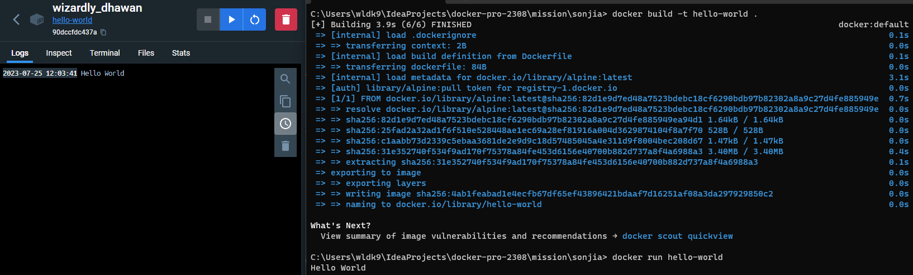

### 1. 컨테이너 기술이란 무엇입니까? (100자 이내로 요약)

- 실행에 필요한 모든 파일을 포함한 전체 실행 환경에서 애플리케이션을 패키징할 수 있는 기술로, 전체 기능을 유지하면서 애플리케이션을 환경 간에 쉽게 이동할 수 있습니다.

 

### 2. 도커란 무엇입니까? (100자 이내로 요약)

- 어플리케이션의 실행에 필요한 환경을 하나의 이미지로 모아두고, 다양한 환경에서 어플리케이션 실행 환경을 구축 및 운용하기 위한 컨테이너 기반의 오픈소스 플랫폼입니다.

 

### 3. 도커 파일, 도커 이미지, 도커 컨테이너의 개념은 무엇이고, 서로 어떤 관계입니까?

- 도커 파일 : 도커 이미지를 생성하기 위한 설정 파일

- 도커 이미지 : 소스 코드, 라이브러리, 종속성, 도구 및 응용 프로그램을 실행하는데 필요한 기타 파일을 포함하는 변경 불가한 파일로, 실행 환경을 위한 일종의 템플릿

- 도커 컨테이너 : 사용자가 기본 시스템에서 애플리케이션을 분리할 수 있는 가상화된 실행 환경

 

도커 파일은 도커 이미지를 빌드하는 방법을 정의하는 스크립트로, 이 파일을 빌드하여 도커 이미지를 생성합니다. 이미지는 특정 환경에 대한변경 불가한 파일로 정적인 형태의 파일이며, 이를 동적인 형태로 변경한 것이 가상화된 실행 환경인 컨테이너입니다.

따라서 컨테이너가 존재하기 위해서는 이미지를 실행해야 하며, 컨테이너는 이미지에 종속되어 런타임 환경을 구성하고 애플리케이션을 실행하는 데 사용된다고 할 수 있습니다.

 

### 4. [실전 미션] 도커 설치하기 (참조: [도커 공식 설치 페이지](https://docs.docker.com/engine/install/))
- 아래 `도커 설치부터 실행 튜토리얼`을 참조하여 도커를 설치하고, 도커 컨테이너를 실행한 화면을 캡쳐해서 Pull Request에 올리세요.

