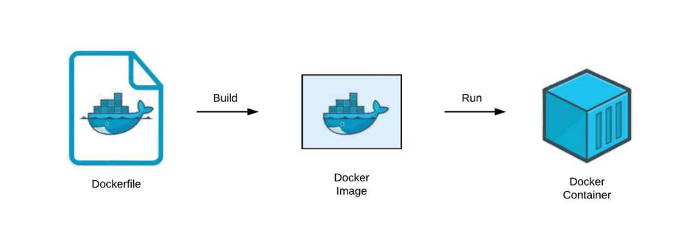
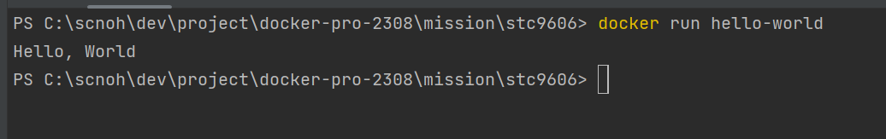

# II. 사전 미션
### 1. 컨테이너 기술이란 무엇입니까? (100자 이내로 요약)
논리적인 공간을 만들고 OS기능을 사용하면서 프로세스를 격리시키고 독립된 다양한 어플리케이션을 설치해 하나의 서버처럼 사용할 수 있는 패키지입니다.
컨테이너를 사용하는 이유는 여러 대의 서버가 존재한다고 가정했을 때 서버에 필요한 환경 설정들을 컨테이너를 사용하여 여러 대의 서버에게 동일한 환경을 제공할 수 있습니다. 그러므로 일일이 서버마다 환경을 구축하는 수고가 줄어들어 컨테이너를 효율적으로 사용할 수 있습니다.

### 2. 도커란 무엇입니까? (100자 이내로 요약)
도커는 컨테이너 기술을 기반으로 만든 일종의 가상화 플랫폼입니다.
컨테이너를 관리하는 도구로서, 도커를 이용하면 도커 이미지를 실행시켜 컨테이너를 실행 시킬 수 있고
다시 이미지로 만드는 작업을 쉽게 도와줍니다.

### 3. 도커 파일, 도커 이미지, 도커 컨테이너의 개념은 무엇이고, 서로 어떤 관계입니까?
- 도커 파일: 도커 이미지를 실행할 방법에 대해서 정의하는 파일
- 도커 이미지: 도커에서 서비스 운영에 필요한 서버 프로그램, 소스코드 및 라이브러리, 컴파일된 실행파일을 묶은 형태를 도커 이미지라고 한다.
- 도커 컨테이너: 도커 이미지를 실행한 상태로서, 응용프로그램의 종속성과 함께 응용프로그램 자체를 패키징 또는 캡슐화하여 격리된 공간에서 프로세스를 동작시키는 기술이다.

- 관계

### 4. [실전 미션] 도커 설치하기 (참조: [도커 공식 설치 페이지](https://docs.docker.com/engine/install/))
- 아래 `도커 설치부터 실행 튜토리얼`을 참조하여 도커를 설치하고, 도커 컨테이너를 실행한 화면을 캡쳐해서 Pull Request에 올리세요.

