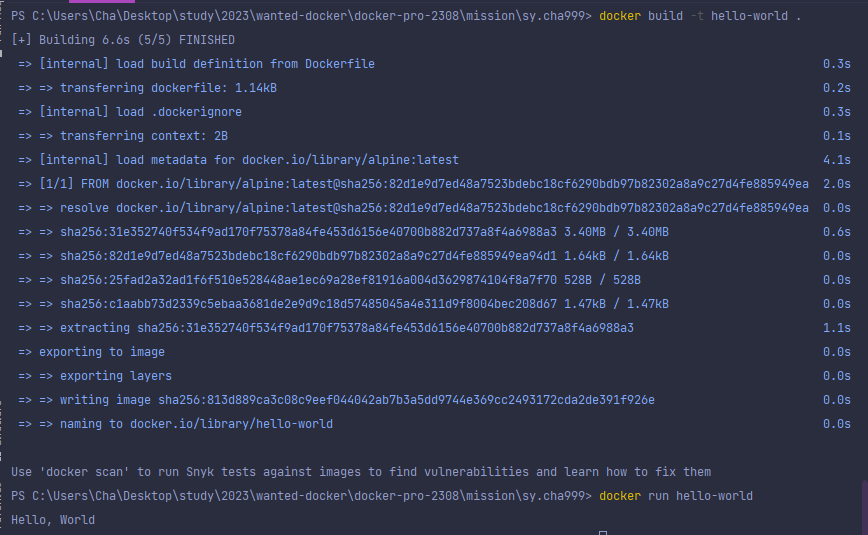

### 1. 컨테이너 기술이란 무엇입니까? (100자 이내로 요약)
=> 컨테이너 기술은 응용 프로그램을 [격리된 환경]에서 실행하도록 설계된 가벼운 [가상화] 기술입니다.   
[가볍고 이식성]있게 실행할 수 있어 빠른 배포와 [관리 용이성]을 제공합니다.

+) 각각의 컨테이너는 애플리케이션과 그 의존성들을 포함하는 완전한 파일 시스템과 코드, 런타임, 시스템도구,    
시스템 라이브러리를 포함하여 별도의 서버인 것처럼 사용할 수 있게 만듭니다.
* [호스트 OS의 리소스를 논리적으로 분산]시키고 [여러 컨테이너가 공유하여 사용]합니다. 
* 오버헤드가 적기때문에 가볍고 고속으로 작동합니다.
* OS나 디렉토리, IP주소 등과 같은 시스템 자원을 마치 각 애플리케이션이 점유하고 있는것처럼 보이게 합니다. 
* [애플리케이션에 필요한 모든 모듈을 컨테이너로] 모을 수 있기 때문에 여러 컨테이너를 조합해   
하나의 애플리케이션을 구축하는 [마이크로 서비스형 애플리케이션]과 친화성이 좋습니다. 

### 2. 도커란 무엇입니까? (100자 이내로 요약)
=> [컨테이너 기반의 오픈 소스 플랫폼]으로 [애플리케이션과 그 의존성을 격리된 환경에 패키징(이미지)]하여   
빠르고 이식성 높게 실행하고 배포하는 기술입니다. 

+) 개발환경과 운영환경 사이의 일관성을 제공하고 (DevOps), 마이크로서비스 아키텍처와 클라우드 기반 환경에서   
특히 유용하게 사용됩니다. 

### 3. 도커 파일, 도커 이미지, 도커 컨테이너의 개념은 무엇이고, 서로 어떤 관계입니까?
**도커 파일**    
애플리케이션을 [도커 이미지로 빌드하기 위한 설정 파일]입니다. 일련의 명령어와 지시문을 포함하며,   
이를 사용해 애플리케이션 실행에 필요한 환경과 설정을 정의합니다. 주로 기존 이미지를 기반으로   
필요한 구성과 소스코드 등을 추가하여 새로운 컨테이너 이미지를 생성하는 데 사용합니다.

**도커이미지**   
[도커파일을 기반으로 생성된 실행가능한 가상환경]으로, 애플리케이션과 그 의존성들을 포함합니다.   
이미지는 컨테이너를 실행하는데 필요한 모든 정보를 가지고 있으며 애플리케이션 실행에 필요한   
[모든 설정과 라이브러리 등을 패키징한 상태]입니다. 

**도커 컨테이너**   
[도커 이미지를 실행하는 실행 가능한 인스턴스] 입니다. 도커 이미지를 기반으로 [격리된 환경]에서   
애플리케이션과 그 의존성들을 실행할 수 있습니다.   

도커파일을 작성하고 도커 클라이언트 빌드 명령을 통해 도커 이미지를 생성합니다.    
도커 이미지는 도커 레지스트리에 저장되거나 호스트 머신의 로컬 저장소에 저장됩니다.   
도커 이미지는 해당 이미지를 기반으로 하는 컨테이너를 여러개 생성할 수 있으며,   
이러한 컨테이너는 모두 이미지의 설정과 환경을 공유하면서 격리된 환경에서 실행됩니다. 

*** 

### [실전 미션] 도커 설치하기 (참조: 도커 공식 설치 페이지)
아래 도커 설치부터 실행 튜토리얼을 참조하여 도커를 설치하고,
도커 컨테이너를 실행한 화면을 캡쳐해서 Pull Request에 올리세요.

