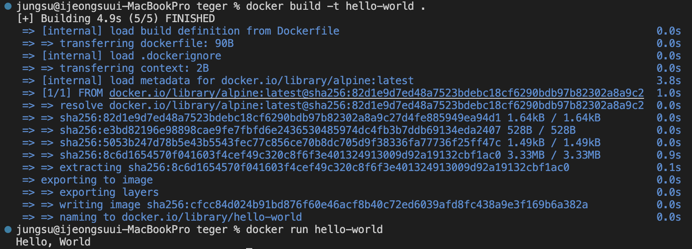

### 1. 컨테이너 기술이란 무엇입니까? (100자 이내로 요약)

    컨테이너 기술은 응용 프로그램과 모든 필요한 구성 요소를 포함하는 독립적인 실행 환경을 만들어 내는 가상화 기술입니다. 이로 인해 애플리케이션의 이식성, 확장성, 보안성이 향상되며, 클라우드 및 데이터 센터에서 효율적인 배포와 관리가 가능해집니다.

### 2. 도커란 무엇입니까? (100자 이내로 요약)

    도커는 컨테이너 기반 가상화 플랫폼으로, 애플리케이션을 격리된 환경에서 실행시켜 이식성과 효율성을 높이는 오픈 소스 기술입니다.

### 3. 도커 파일, 도커 이미지, 도커 컨테이너의 개념은 무엇이고, 서로 어떤 관계입니까?

    1. 도커 파일 (Dockerfile):
     도커 파일은 도커 이미지를 생성하는 데 사용되는 텍스트 파일입니다. 도커 파일은 애플리케이션을 실행하는 데 필요한 모든 설정과 명령어를 포함하며, 도커 이미지를 구성하는 데 사용됩니다.

    2. 도커 이미지 (Docker Image):
     도커 이미지는 도커 파일을 기반으로 만들어진 실행 가능한 패키지입니다. 이 이미지에는 애플리케이션 실행에 필요한 모든 코드, 라이브러리, 의존성 및 환경 설정이 포함되어 있습니다. 도커 이미지는 읽기 전용이며 수정이 불가능하며, 컨테이너를 생성하는 데 사용됩니다.

    3. 도커 컨테이너 (Docker Container):
     도커 컨테이너는 도커 이미지를 기반으로 실행된 가상 환경입니다. 도커 컨테이너는 격리된 공간에서 애플리케이션과 해당 환경을 실행합니다. 각각의 도커 컨테이너는 독립적으로 실행되며, 호스트 머신과 격리되어 있습니다.

    4. 관계:
     도커 파일은 도커 이미지를 만들기 위한 빌드 과정을 정의합니다. 도커 이미지는 이러한 빌드 과정의 결과물이며, 애플리케이션을 실행하는 데 필요한 모든 구성 요소가 포함되어 있습니다. 이렇게 생성된 도커 이미지를 기반으로 도커 컨테이너를 여러 개 생성하여 각각의 독립된 실행 환경에서 애플리케이션을 구동할 수 있습니다.

### 4. [실전 미션] 도커 설치하기 (참조: 도커 공식 설치 페이지)

