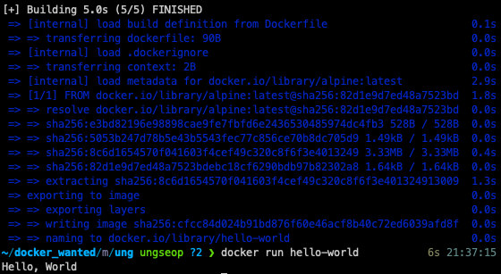

## 사전미션

---

### 1. 컨테이너 기술이란 무엇입니까?
컨테이너는 한마디로 정의하면 '리소스가 격리된 프로세스'로 하나의 OS 상에서 여러 개를 동시에 가동할 수 있으며, 각각 독립된 루트 파일 시스템, CPU/메모리, 프로세스 공간 등을 사용할 수 있다.
 

### 2. 도커란 무엇입니까?
도커는 컨테이너 기반의 오픈소스 가상화 플랫폼으로 '도커 이미지'라는 기술을 사용하여 이미지를 공유한다. 또한 도커 허브라는 도커 이미지 공유 레지스트리가 존재한다.
 

### 3. 도커 파일, 도커 이미지, 도커 컨테이너의 개념은 무엇이고, 서로 어떤 관계입니까?
도커 이미지는 컨테이너 실행에 필요한 파일과 설정 값들을 포함혹 있는 것으로 상태값을 가지고 변하지 않는다. 이런 이미지를 생성하기 위한 용도로 작성하는 것이 도커파일이다. 도커 컨테이너는 도커 이미지를 실행한 상태로 이미지를 통해 생성된 컨테이너를 의미한다.

### 4. [실전 미션] 도컬 설치하기

