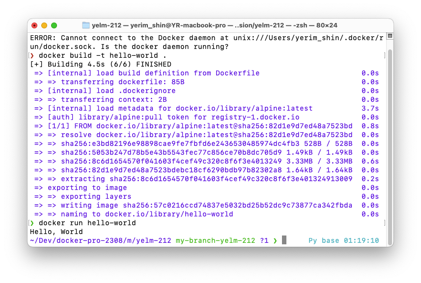

1. 컨테이너 기술이란 무엇입니까? (100자 이내로 요약)

일종의 표준화된 소프트웨어 유닛으로, 다양한 상품을 넣을 수 있으나 넣은 뒤에는 자체적으로 보관 및 격리된다. 코드를 실행하는데 필요한 종속성과 도구가 포함되어 있으며, 동일한 환경에서 동일한 어플리케이션을 실행함을 보장한다.

2. 도커란 무엇입니까? (100자 이내로 요약)

도커란 일종의 컨테이너와 같으며, 컨테이너의 생성 및 관리 프로세스를 단순화하는 도구로 빌드 및 관리를 돕는다.

3. 도커 파일, 도커 이미지, 도커 컨테이너의 개념은 무엇이고, 서로 어떤 관계입니까?

도커파일 
- 도커 이미지 를 만들고 실행하는 데 필요한 단계를 정의하는 간단한 구문 파일
- Dockerfile을 변경하고 이미지를 다시 빌드하면 변경된 레이어 만 다시 빌드된다.

이미지
- 이미지는 컨테이너를 위한 템플릿 / 청사진이다.
- 읽기 전용이며, 변경된 소스 코드를 적용하기 위해서는 이미지를 새로 빌드해야 한다.
- 코드와 필요한 툴 / 실행환경을 포함한다.
- 일종의 공유 컨테이너이다.

컨테이너
- 컨테이너는 소프트웨어가 실행되는 단위이다.
- 이미지를 기반으로 다양한 환경에서 실행될 수 있다.
- 일단 컨테이너가 실행되면, 해당 컨테이너는 독립적인 stand-alone이다.

4. [실전 미션] 도커 설치하기 

