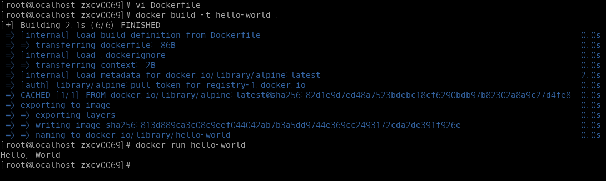

## 1. 컨테이너 기술이란 무엇입니까? (100자 이내로 요약)

- 컨테이너는 애플리케이션과 해당 종속성(라이브러리, 설정 파일 등)을 격리된 환경에서 실행할 수 있도록 해주는 기술입니다.
- 애플리케이션의 개발과 배포가 수월해지며, 애플리케이션의 독립성과 확장성이 높아집니다.

## 2. 도커란 무엇입니까? (100자 이내로 요약)

컨테이너에 여러 기능을 추가함으로써 애플리케이션을 컨테이너로서 좀 더 쉽게 사용할 수 있게 만들어진 오픈소스입니다.
가상 머신과는 달리 성능의 손실이 거의 없습니다.

## 3. 도커 파일, 도커 이미지, 도커 컨테이너의 개념은 무엇이고, 서로 어떤 관계입니까?

### Dockerfile

완성된 이미지를 생성하기 위해 컨테이너에 설치해야 하는 패키지, 추가해야 하는 소스코드, 실행해야 하는 명령어와 셸 스크립트 등을 Dockerfile에 기록해 두면 도커는 이 파일을 읽어 컨테이너에서 작업을 수행한 뒤 이미지로 만들어냅니다.

### Docker image

- 도커 이미지는 소스 코드, 라이브러리, 종속성, 도구 및 응용 프로그램을 실행하는데 필요한 기타 파일을 포함하는 불변(변경 불가) 파일입니다.
- 컨테이너를 생성할 때 필요한 요소이며, 읽기 전용으로 사용됩니다.

### Docker container

이미지를 실행한 상태로,해당 이미지의 목적에 맞는 파일이 들어 있는 파일시스템과 격리된 자원 및 네트워크를 사용할 수 있는 독립된 공간입니다.

### 관계

도커 컨테이너를 생성하려면 도커이미지가 필요하며, Dockerfile을 사용하면 직접 컨테이너를 생성하고 이미지로 커밋해야 하는 번거로움을 덜 수 있고 애플리케이션의 빌드 및 배포를 자동화할 수 있습니다.

## 4. [실전 미션] 도커 설치하기 (참조: 도커 공식 설치 페이지)

