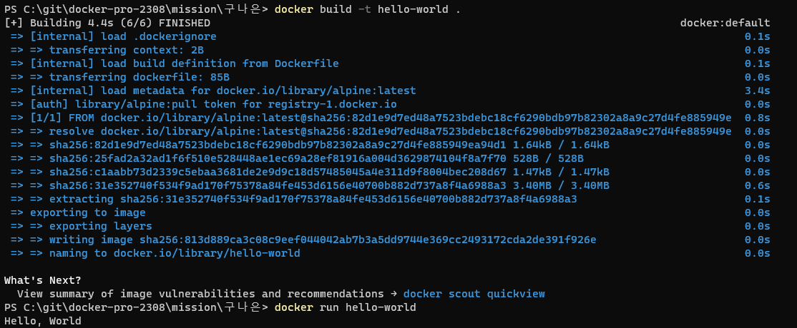

## II. 사전 미션
### 1. 컨테이너 기술이란 무엇입니까? (100자 이내로 요약)
* 컨테이너는 실행에 필요한 모든 파일을 포함한 전체 실행(runtime) 환경에서 애플리케이션을 패키징하고 격리할 수 있는 기술입니다.

### 2. 도커란 무엇입니까? (100자 이내로 요약)
* 도커는 컨테이너 내부에서 이미지(COW:copy-on-write) 스냅샷을 사용하여 개발, 테스트, 운영 등 다양한 환경에 컨테이너식 애플리케이션 또는 소프트웨어를 구현합니다.

### 3. 도커 파일, 도커 이미지, 도커 컨테이너의 개념은 무엇이고, 서로 어떤 관계입니까?
* 도커 파일 : 도커 이미지를 빌드하기 위한 지침으로 구성된 텍스트 파일.
* 도커 이미지 : 서비스 운영에 필요한 서버 프로그램, 소스코드 및 라이브러리, 컴파일된 실행 파일을 묶는 형태. 특정 프로세스를 실행하기 위한 모든 파일과 설정값(환경)을 지님.
* 도커 컨테이너 : 이미지를 실행한 상태. 응용프로그램 자체를 패키징하여 격리된 공간에서 프로세스를 동작시키는 기술.

* 도커 파일을 통해 도커 이미지를 빌드하고, 도커 이미지는 컨테이너에 추가해야 사용할 수 있으며, 도커 컨테이너는 도커 파일과 이미지를 기반으로 동작한다.

 
### 4. [실전 미션] 도커 설치하기
