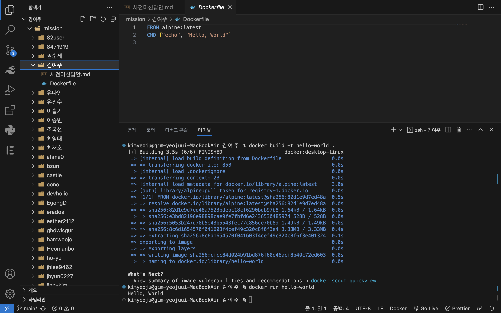

# 사전 미션
## 1. 컨테이너 기술이란 무엇입니까? (100자 이내로 요약)
- 컨테이너 기술은 모듈화되고 격리된 컴퓨팅 공간 또는 컴퓨팅 환경 어플리케이션을 구동하는 환경을 격리한 공간을 의미하며 어플리케이션을 독립적인 단위로 패키징하고 배포하는 기술입니다.

## 2. 도커란 무엇입니까? (100자 이내로 요약)
- 도커는 애플리케이션을 개발하고, 배포하고, 실행할 수 있는 오픈 플랫폼으로 컴퓨터의 다른 환경으로부터 분리되어 컨테이너라는 독립된 환경에서 내 애플리케이션을 실행할 수 있습니다.

## 3. 도커 파일, 도커 이미지, 도커 컨테이너의 개념은 무엇이고, 서로 어떤 관계입니까?
- 도커 파일(Dockerfile): 도커 이미지를 생성하는 데 사용되는 파일로, 이미지에 포함될 파일, 폴더, 도커 빌드 명령어 등이 포함됩니다.

- 도커 이미지(Docker image): 도커에서 서비스 운영에 필요한 서버 프로그램, 소스코드 및 라이브러리, 컴파일된 실행 파일을 묶는 형태를 말합니다.

- 도커 컨테이너(Docker container): 이미지를 실행한 상태로, 응용프로그램의 중속성과 함께 응용프로그램 자체를 패키징 또는 캡슐화하여 격리된 공간에서 프로세스를 동작시키는 기술입니다.

- 따라서 서로의 관계로는 도커 파일은 도커 이미지를 빌드하는데 사용되고, 도커 이미지는 도커 컨테이너를 실행하는데 필요한 모든 것을 포함하고 있으며, 도커 컨테이너는 이러한 도커 파일과 이미지를 기반으로 생성되어 실행됩니다.

## 4. [실전 미션] 도커 설치하기 (참조: 도커 공식 설치 페이지)
