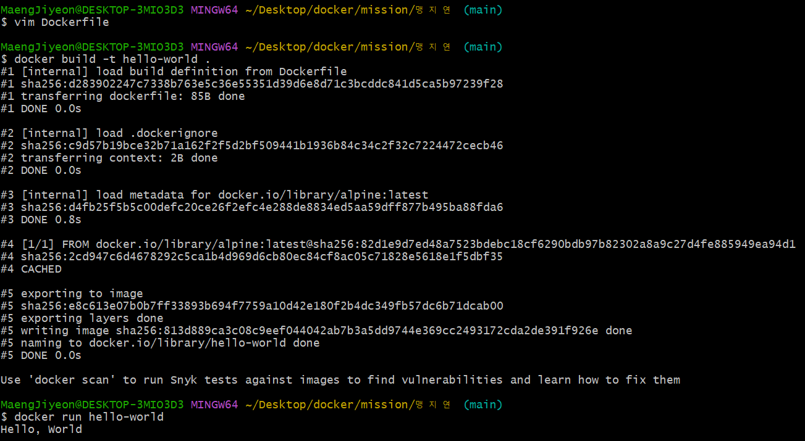

### 1. 컨테이너 기술이란 무엇입니까? (100자 이내로 요약)
---
컨테이너는 격리된 공간에서 프로세스가 동작하는 기술입니다. 가볍고 빠르게 동작하며 CPU나 메모리는 프로세스가 필요한 만큼만 추가로 사용하기에 성능적으로도 거의 손실이 없습니다.

### 2. 도커란 무엇입니까? (100자 이내로 요약)
---
도커는 컨테이너 기반의 오픈소스 가상화 플랫폼입니다. 도커는 소프트웨어의 실행에 필요한 모든 것들이 실행 중인 환경에 관계 없이 언제나 동일하게 실행될 것을 보증합니다.

### 3. 도커 파일, 도커 이미지, 도커 컨테이너의 개념은 무엇이고, 서로 어떤 관계입니까?
---
- 도커 파일
	도커에서 이용하는 이미지를 기반으로 하여 새로운 이미지를 스크립트 파일을 통해 내가 설정한 나만의 이미지를 생성할 수 있는 일종의 이미지 설정 파일입니다.

- 도커 이미지
	도커에서 서비스 운영에 필요한 서버 프로그램, 소스코드 및 라이브러리, 컴파일된 실행 파일을 묶는 형태를 말합니다.

- 도커 컨테이너
	도커 이미지를 실행한 상태로, 응용프로그램의 종속성과 함께 응용프로그램 자체를 패키징이나 캡슐화하여 격리된 공간에서 프로세스를 동작시키는 기술입니다.

### 4. [실전 미션] 도커 설치하기 (참조: 도커 공식 설치 페이지)
---
