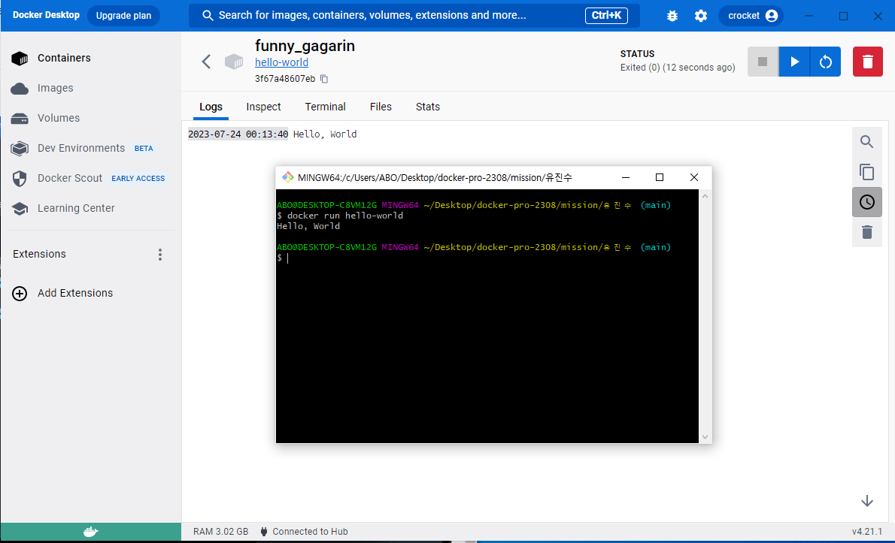

## II. 사전 미션

1. 컨테이너 기술이란 무엇입니까? (100자 이내로 요약)
    - 컨테이너는 소프트웨어 서비스를 실행하는 데 필요한 특정 버전의 프로그래밍 언어 런타임 및 라이브러리와 같은 종속 항목과 애플리케이션 코드를 함께 포함하는 경량 패키지입니다.

2. 도커란 무엇입니까? (100자 이내로 요약)
    - 도커는 컨테이너를 생성, 관리 및 배포하기 위한 오픈 소스 플랫폼으로, 애플리케이션의 실행 환경을 포함한 모든 종속성을 이미지라는 형태로 패키징합니다.

3. 도커 파일, 도커 이미지, 도커 컨테이너의 개념은 무엇이고, 서로 어떤 관계입니까?

    - 도커 파일(Dockerfile):
        - 도커 파일은 도커 이미지를 생성하기 위한 설정 스크립트입니다. 주로 베이스 이미지(기본적인 실행 환경) 위에 필요한 애플리케이션 코드, 라이브러리, 설정 파일 등을 추가하여 커스텀 이미지를 만들기 위해 사용됩니다. 도커 파일은 텍스트 파일로 작성되며, 여러 개의 명령어를 포함하여 이미지를 구성하는 단계를 정의합니다.

    - 도커 이미지(Docker Image):
        - 도커 이미지는 도커 파일을 기반으로 만들어진 실행 가능한 패키지입니다. 도커 이미지는 컨테이너를 실행하는 데 필요한 모든 것들을 포함하고 있으며, 파일 시스템, 애플리케이션 코드, 라이브러리, 환경 변수 등을 담고 있습니다. 이미지는 읽기 전용이며 변경 불가능하며, 여러 대의 서버나 환경에서 동일한 실행 환경을 보장하여 이식성과 확장성을 제공합니다.

    - 도커 컨테이너(Docker Container):
        - 도커 컨테이너는 도커 이미지의 인스턴스로, 실행 중인 애플리케이션을 격리된 환경에서 동작하게 해줍니다. 컨테이너는 이미지를 기반으로 생성되며, 각 컨테이너는 서로 독립적인 파일 시스템과 프로세스 공간을 갖습니다. 이를 통해 여러 개의 컨테이너를 단일 호스트에서 실행하여 리소스를 효율적으로 관리하고, 애플리케이션 간의 충돌을 방지할 수 있습니다.

    - 관계 설명

        - 도커 파일은 도커 이미지를 만들기 위한 설정 스크립트이며, 이미지를 구성하는 명령어를 담고 있습니다.
        - 도커 이미지는 도커 파일을 기반으로 만들어지며, 컨테이너를 실행하는 데 필요한 모든 구성 요소를 포함합니다.
        - 도커 컨테이너는 도커 이미지의 인스턴스로, 이미지를 실행하여 격리된 환경에서 애플리케이션을 구동합니다. 한 이미지로 여러 개의 컨테이너를 생성하여 여러 개의 동일한 환경에서 애플리케이션을 실행할 수 있습니다.
        - 이렇게 도커 파일을 작성하여 도커 이미지를 생성하고, 해당 이미지로 여러 개의 독립적인 도커 컨테이너를 만들어 실행함으로써, 애플리케이션을 효율적으로 관리하고 이식성과 확장성을 높일 수 있습니다.

4. [실전 미션] 도커 설치하기 (참조: [도커 공식 설치 페이지](https://docs.docker.com/engine/install/))
- 아래 `도커 설치부터 실행 튜토리얼`을 참조하여 도커를 설치하고, 도커 컨테이너를 실행한 화면을 캡쳐해서 Pull Request에 올리세요.

