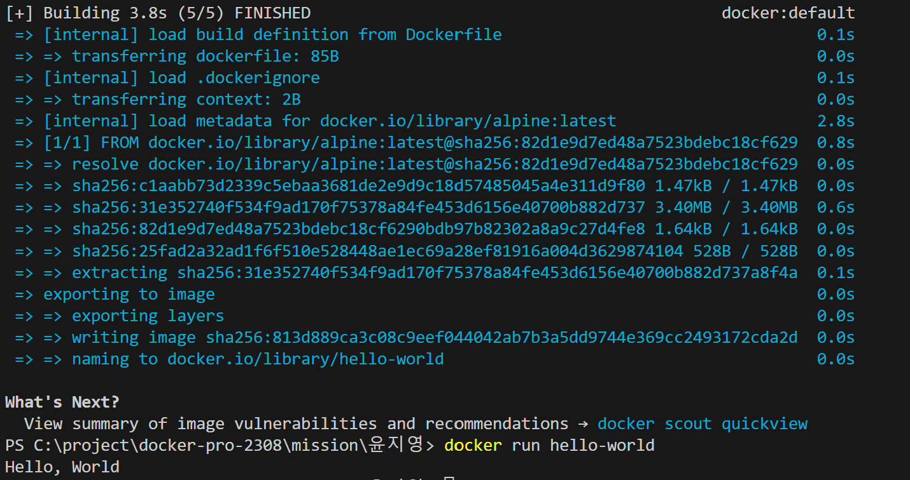

# 사전 미션

## 1. 컨테이너 기술이란 무엇입니까?

- 컨테이너 기술은 애플리케이션을 격리된 환경에서 실행함으로 애플리케이션과 환경과의 상호의존성을 최소화하고 이식성과 확장성을 높인 기술입니다.

## 2. 도커란 무엇입니까?

- 도커란 컨테이너 기반 가상화 플랫폼으로, 애플리케이션을 독립된 환경에서 실행시킬 수 있도록 해주는 오픈소스 소프트웨어입니다.

## 3. 도커 파일, 도커 이미지, 도커 컨테이너의 개념은 무엇이고, 서로 어떤 관계입니까?

- 도커 파일은 토커 이미지를 생성하기 위한 파일
- 도커 이미지은 도커파일을 기반으로 만들어진 실행가능한 패키지
- 도커 컨테이너은 도커이미지에서 실행한 인스턴스

도커파일을 작성하여 파일에 기술된 단계들을 순서대로 실행하여 도커 이미지를 빌드합니다. 이렇게 생성된 도커이미지는 여러개의 도커 컨테이너를 생성하고 실행하는데 사용 됩니다.

## 4. [실전 미션] 도커 설치하기

