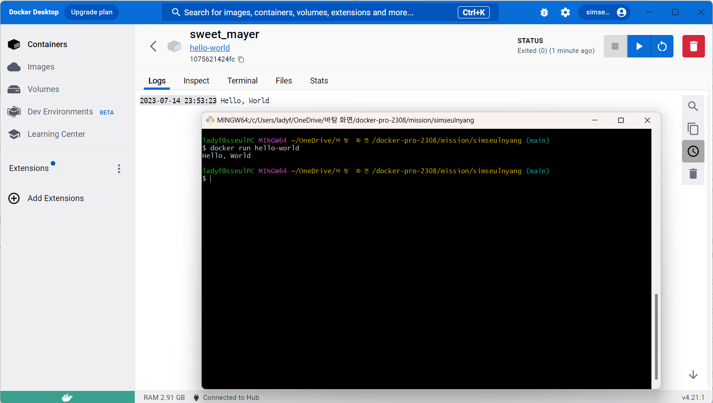

# 사전 미션
## 1. 컨테이너 기술이란 무엇입니까? (100자 이내로 요약)
- 컨테이너 기술은 애플리케이션을 독립적인 단위로 패키징하고 배포하는 기술이며, 컨테이너는 운영체제의 커널을 공유하기 때문에 가상머신 보다 효율적이며, 빠르게 배포하고 관리할 수 있습니다.

## 2. 도커란 무엇입니까? (100자 이내로 요약)
- 도커는 애플리케이션을 개발하고, 전달하고, 실행할 수 있는 오픈 플랫폼으로 컴퓨터의 다른 환경으로부터 분리되어 컨테이너라는 독립된 환경에서 내 애플리케이션을 실행할 수 있습니다.

## 3. 도커 파일, 도커 이미지, 도커 컨테이너의 개념은 무엇이고, 서로 어떤 관계입니까?
- **도커 파일**은 도커 이미지를 생성하는 데 사용되는 파일로, 이미지에 포함될 파일, 폴더, 도커 빌드 명령어 등이 포함됩니다.
- **도커 이미지**는 도커 컨테이너를 실행하는 데 필요한 파일과 설정을 포함하는 독립적인 단위로 도커 레지스트리에서 공유할 수 있습니다.
- **도커 컨테이너**는 도커 이미지를 기반으로 실행되는 가상머신으로 운영체제의 커널을 공유하기 때문에 가상머신보다 효율적입니다.
- 즉, 도커 파일은 도커 이미지를 만드는 데 사용되고, 도커 이미지는 도커 컨테이너를 만드는 데 사용되며, 도커 컨테이너는 도커 파일과 이미지를 기반으로 실행됩니다.

## 4. [실전 미션] 도커 설치하기 (참조: 도커 공식 설치 페이지)
